# Examen Verslag

TDI 500 — Contingency KPI Dashboard

Activity 3.4 — Proof of Concept

| **Kandidaat**          | Destiny Tiyjudy                    |
|------------------------|------------------------------------|
| **Studentnummer**      | 9015646                            |
| **Klas**               | PALVSOD3B                          |
| **Examencode**         | SD_SD20_PvB1_B1-K1-2_3v1           |
| **BPV Bedrijf**        | TBI SSC ICT                        |
| **Praktijkbegeleider** | Jeroen Pat                         |
| **Sprint**             | 16 maart – 27 maart 2026           |
| **GitHub**             | Marvel-School/tdi500-kpi-dashboard |

# 1. Planning & Ontwerp (B1-K1-W1 / W2)

*De diagrammen in 1.7 tot en met 1.10 laten de architectuur zien zoals ik die aan het begin van de sprint had ontworpen. Tijdens de sprint en in de Path A-uitbreidingen daarna zijn er dingen veranderd of bijgekomen. Die staan beschreven in hoofdstuk 4 (Verbetervoorstellen). De diagrammen zijn bewust niet bijgewerkt om het oorspronkelijke ontwerp te tonen.*

## 1.1 Eisen, wensen en technische uitgangspunten

Dit hoofdstuk beschrijft de eisen en uitgangspunten zoals die voor deze sprint zijn vastgesteld. Het project valt onder Werkpakket 3.2 van het TDI 500-programma: een MOOI-subsidieproject van TBI/TNO dat als doel heeft de installatie van (hybride) warmtepompen te versnellen. Het projectplan beschrijft een installateursportaal in vijf fases, van een uniform informatieportaal (fase 1) tot integratie met het smart grid (fase 5). Deze sprint richt zich op een Proof of Concept van delen van fase 1, 2 en 3.

*In de Examenafspraken is dit als Werkpakket 3.4 aangeduid. Volgens de huidige TDI 500-projectstructuur (zoals afgestemd met praktijkbegeleider Jeroen Pat) is dit Werkpakket 3.2; ik gebruik die aanduiding in dit verslag.*

### Functionele eisen

De functionele eisen voor deze sprint zijn vastgelegd als user stories (#1 t/m #11, zie 1.2). Op hoofdlijnen moest het dashboard:

- Warmtepompgegevens uit de Hupie API ophalen via SPARQL en deze data uniform tonen, ongeacht de fabrikant van de warmtepomp
- De ontologie HCO en de standaard SAREF gebruiken om eenheden en eigenschappen op een consistente manier te interpreteren (bijvoorbeeld `saref:isMeasuredIn` automatisch resolven naar °C of kWh)
- KPI's berekenen en tonen op contingentniveau (groepen woningen met vergelijkbare eigenschappen), niet per individuele woning — dit ondersteunt de contingentenaanpak die centraal staat in TDI 500
- Een beslissingsondersteuning (Decision Support) bieden waarmee installateurs en planners per contingent advies krijgen over het meest geschikte installatieconcept
- Werken op desktop, tablet en mobiel (responsief)

### Wensen

Voor deze sprint is geen aparte wensenlijst opgesteld. Het project is een lange-termijn ontwikkeltraject; deze 2-weekse sprint richt zich op de vastgestelde scope voor het examen. De Path A-uitbreidingen (rolwisselaar, BAG-opzoekketen, TNO-catalogus — zie 1.2) zouden in een traditionele projectopzet als wensen geclassificeerd zijn, omdat ze na de oorspronkelijke sprintscope zijn toegevoegd.

### Technische uitgangspunten

De externe technische randvoorwaarden voor deze sprint:

- **Datatoegang:** de Hupie API is de primaire databron voor warmtepompgegevens. Communicatie verloopt via SPARQL queries over HTTPS.
- **Ontologiestandaarden:** de Heatpump Common Ontology (HCO), SAREF en de ketenstandaarden zijn vastgelegd door TNO en moeten worden gevolgd voor het mappen van inkomende data naar het frontend datamodel.
- **Browserondersteuning:** de twee meest recente versies van Chrome, Firefox, Edge en Safari. Dit komt overeen met de standaard browserlist van Vite waarmee de applicatie wordt gebouwd.
- **Hosting:** als Proof of Concept wordt het dashboard online beschikbaar gemaakt zodat de product owner het kan bekijken zonder lokale installatie.
- **Schaalbaarheid:** voor deze sprint zijn er geen prestatie-eisen geformuleerd. Op termijn moet het dashboard ongeveer 400 datasets kunnen verwerken, maar dat valt buiten de scope van dit examenproject.
- **Beveiliging en privacy:** de API-credentials worden bewaard in environment variables en niet in de repository; data wordt geanonimiseerd op contingentniveau verwerkt. Verdere onderbouwing in 1.12.

De keuze voor de specifieke technologieën (React, TypeScript, Material UI, ApexCharts, Vitest, etc.) is door mij gemaakt en wordt toegelicht in 1.11.

## 1.2 User stories met acceptatiecriteria

De user stories voor dit project zijn vastgelegd als GitHub Issues op `Marvel-School/tdi500-kpi-dashboard`. Iedere user story volgt het standaardformaat (*"Als [rol] wil ik [doel] zodat [waarde]"*) met een lijst acceptatiecriteria. De 11 sprintstories (#1 t/m #11) zijn in de planweek vóór de sprint opgesteld; tijdens de sprint is daaraan gewerkt en in de daaropvolgende weken zijn deze afgesloten. Daarnaast zijn er Path A-stories (#50 t/m #53) toegevoegd voor uitbreidingen die na de sprint zijn opgepakt — daarover meer in een aparte sub-sectie verderop.

### Sprintstories

Onderstaande 11 stories vormden de sprint backlog bij de start van de sprint. De volledige tekst van elke story staat op GitHub; de drie meest centrale stories zijn hieronder uitgewerkt.

| # | Titel | Status | Categorie |
|---|-------|--------|-----------|
| #1 | [#1: Systeem-ontwerp & architectuurdocumenten](https://github.com/Marvel-School/tdi500-kpi-dashboard/issues/1) | Afgerond | Ontwerp |
| #2 | [#2: Hupie API-authenticatie en -verbinding](https://github.com/Marvel-School/tdi500-kpi-dashboard/issues/2) | Afgerond | Backend / API |
| #3 | [#3: Datamapping — ontologie naar frontend-modellen](https://github.com/Marvel-School/tdi500-kpi-dashboard/issues/3) | Afgerond | Datalaag |
| #4 | [#4: Automatische contingent-koppeling — KPI's filteren per contingent](https://github.com/Marvel-School/tdi500-kpi-dashboard/issues/4) | Afgerond | Business logic |
| #5 | [#5: Dashboard-UI en componentarchitectuur](https://github.com/Marvel-School/tdi500-kpi-dashboard/issues/5) | Afgerond | Frontend / UI |
| #6 | [#6: KPI-visualisatie — grafiekcomponenten](https://github.com/Marvel-School/tdi500-kpi-dashboard/issues/6) | Afgerond | Datavisualisatie |
| #7 | [#7: Beslissingsondersteuning — installatieaanbevelingen](https://github.com/Marvel-School/tdi500-kpi-dashboard/issues/7) | Afgerond | Beslissingsondersteuning |
| #8 | [#8: Testplan en uitvoering](https://github.com/Marvel-School/tdi500-kpi-dashboard/issues/8) | Open | Documentatie |
| #9 | [#9: Verbetervoorstellen — analyse en voorstellen](https://github.com/Marvel-School/tdi500-kpi-dashboard/issues/9) | Open | Documentatie |
| #10 | [#10: Sprint Review / presentatie](https://github.com/Marvel-School/tdi500-kpi-dashboard/issues/10) | Open | Ceremonie |
| #11 | [#11: Retrospective — procesreflectie](https://github.com/Marvel-School/tdi500-kpi-dashboard/issues/11) | Open | Ceremonie |

#### #1 Systeem-ontwerp & architectuurdocumenten

> **Als** ontwikkelaar die start met het TDI 500 Contingency Dashboard,
> **wil ik** een complete set ontwerp- en architectuurdocumenten,
> **zodat** ik een duidelijke blueprint heb voordat ik begin met coderen en mijn ontwerpproces kan demonstreren voor werkproces B1-K1-W2.

Voorafgaand aan het programmeren van het dashboard moeten de systeemarchitectuur en de gebruikersinterface formeel worden ontworpen. Dit ticket dekt alle visuele en technische blueprints die nodig zijn voor het TDI 500 Contingency Dashboard, zorgt ervoor dat de datamapping vanuit de Heatpump Common Ontology (HCO) is uitgewerkt, en behandelt de standaarden voor privacy, security en ethiek. Alle deliverables uit dit ticket zijn opgenomen in dit examenverslag.

**Acceptatiecriteria:**

*Wireframes (desktop + mobiel):*

- Visuele mockups gemaakt in Figma die de volledige dashboard-layout tonen
- Wireframes bevatten: contingent-selectie, KPI-grafiekvisualisaties en het beslissingsondersteuningscomponent
- Zowel desktop- als mobiel/tablet-versies zijn ontworpen
- Wireframes zijn geëxporteerd (PNG of SVG) en toegevoegd aan het examenverslag

*Componentendiagram (React-architectuur):*

- Diagram toont de React-componentboom / hiërarchie
- Alle hoofdcomponenten zijn benoemd en hun verantwoordelijkheid is duidelijk (bijv. `<DashboardLayout>`, `<ContingentSelector>`, `<KpiChart>`, `<DecisionPanel>`)
- Diagram toont welke componenten welke services/hooks gebruiken
- Diagram bevat de volgende architectuurelementen: React Router-routestructuur, `ErrorBoundary` om de applicatie heen, `ThemeProvider` om de applicatie heen, custom `useDashboardData`-hook en welke componenten deze gebruiken, servicelaag (`hupieApi`, `dataMapper`, `kpiAggregator`, `decisionEngine`), configuratielaag (`config.ts`)
- Diagram is opgeslagen als afbeelding en toegevoegd aan het examenverslag

*UML class diagram (TypeScript interfaces):*

- Diagram brengt alle TypeScript interfaces en types in kaart
- Toont hoe ruwe SPARQL-data (volgens HCO- en SAREF-standaarden) is gestructureerd in de code
- Bevat minimaal: `Measurement`, `KeyPerformanceIndicator`, `UnitOfMeasure`, `Contingent`, `HeatPumpSystem`
- Toont de relaties tussen interfaces (bijv. een `Measurement` heeft een `UnitOfMeasure`)
- Diagram is opgeslagen als afbeelding en toegevoegd aan het examenverslag

*Sequence diagram / dataflow:*

- Diagram toont de volledige dataflow:
  1. Gebruiker selecteert een contingent in de UI
  2. React-component triggert een request
  3. Axios verstuurt HTTP POST/GET naar de Hupie API (SPARQL-endpoint)
  4. Hupie API geeft een JSON-respons terug
  5. Frontend parseert en mapt data (HCO/SAREF → TypeScript-modellen)
  6. UI wordt bijgewerkt met KPI-visualisaties
- Diagram is opgeslagen als afbeelding en toegevoegd aan het examenverslag

*Onderbouwing technologiekeuzes:*

- Schriftelijke uitleg waarom de volgende technologieën zijn gekozen: React 18 met TypeScript, Material UI (MUI v5), ApexCharts, Axios
- Iedere keuze is kort vergeleken met minstens één alternatief (bijv. "React vs. Vue", "ApexCharts vs. Chart.js")
- Toegevoegd aan het examenverslag

*Onderbouwing security, privacy en ethiek:*

- **Privacy:** uitleg hoe het dashboard omgaat met potentieel herleidbare data (bijv. anonimisering van adressen uit BAG, alleen geaggregeerde data per contingent)
- **Security:** uitleg hoe Hupie API-credentials worden beheerd (in `.env`, niet in de repo gecommit, `.env` staat in `.gitignore`, communicatie via HTTPS)
- **Ethiek:** uitleg hoe KPI-visualisaties eerlijk en niet-misleidend zijn (correcte assen-schalen, geen cherry-picked dataranges)
- Toegevoegd aan het examenverslag

*Sitemap / routestructuur:*

- Een sitemap toont de pagina-/routestructuur van de applicatie: `/` → Dashboard, `/contingent/:id` → detailweergave per contingent
- Sitemap is opgeslagen in `/docs/diagrams/`
- Wireframes zijn gemaakt voor ALLE routes (niet alleen het dashboard), desktop + mobiel

**Status:** Afgerond op 16 maart 2026. Issue: [#1](https://github.com/Marvel-School/tdi500-kpi-dashboard/issues/1).

#### #2 Hupie API-authenticatie en -verbinding

> **Als** installateur/planner die het dashboard gebruikt,
> **wil ik** dat de applicatie verbinding maakt met de Hupie API en warmtepompdata ophaalt,
> **zodat** ik real-time en historische telemetriedata in het dashboard kan bekijken.

Deze story zet de kern van de HTTP-servicelaag op die de authenticatie en communicatie met het Hupie SPARQL API-endpoint afhandelt. Dit is de fundering waarop alle andere data-afhankelijke features (#3 t/m #7) bouwen — zonder werkende API-verbinding functioneert verder niets. De service moet SPARQL POST/GET-requests naar de Hupie API sturen, de authenticatie regelen en ruwe JSON-responses teruggeven. Data parsing en ontologie-mapping horen bij story #3.

**Acceptatiecriteria:**

*API-service-opzet:*

- Een Axios-gebaseerde API-service is gemaakt in `/src/services/` (bijv. `hupieApi.ts` of `sparqlService.ts`)
- Service leest API-configuratie uit de centrale config-module (`/src/config/index.ts`), NIET rechtstreeks uit `process.env`
- De config-module leest environment variables en levert getypte, gevalideerde configuratie
- Een `.env.example`-bestand staat in de repo-root met de vereiste variabelen (zonder echte waardes)
- `.env` staat in `.gitignore` en wordt **niet** in de repository gecommit
- Als vereiste config-waardes ontbreken, logt de service bij opstarten een duidelijke waarschuwing (geen silent failure)

*SPARQL-query-uitvoering:*

- De service kan een SPARQL-query versturen via HTTP POST naar het Hupie-endpoint
- De service kan een SPARQL-query versturen via HTTP GET als fallback (als POST niet wordt ondersteund voor bepaalde queries)
- Er is een basis-testquery aanwezig (bijv. een lijst van beschikbare warmtepompsystemen ophalen of een eenvoudige `SELECT` op metingen)
- De service ontvangt een `200 OK`-respons met geldige JSON-data

*Foutafhandeling:*

- API-timeout is geconfigureerd (bijv. 10 seconden) — request blijft niet onbeperkt hangen
- HTTP-fouten (4xx, 5xx) worden afgevangen en geven een betekenisvol errorobject terug (geen ruwe Axios-error)
- Netwerkfouten (geen internet, DNS-fout) worden netjes afgevangen
- Alle errorstates worden naar de browserconsole gelogd met genoeg context om te debuggen (endpoint-URL, statuscode, errormessage)

*Response-afhandeling:*

- Ruwe JSON-respons van de API wordt teruggegeven aan de aanroepende component/hook
- Response-structuur is getypt met een TypeScript-interface (bijv. `SparqlResponse` met `results.bindings[]`)
- Geen datatransformatie in deze service — alleen ruwe respons (transformatie hoort bij story #3)

**Status:** Afgerond op 26 maart 2026. Issue: [#2](https://github.com/Marvel-School/tdi500-kpi-dashboard/issues/2).

#### #5 Dashboard-UI en componentarchitectuur

> **Als** installateur/planner die het dashboard opent,
> **wil ik** een nette, gestructureerde interface met duidelijke navigatie en layout,
> **zodat** ik snel de warmtepomp-prestatiedata kan vinden en begrijpen die ik nodig heb.

Deze story dekt het kern-frontendskelet — de layout, navigatie, componenthiërarchie en stylingfundering waarin alle andere UI-features (#4 selector, #6 grafieken, #7 beslissingsondersteuning, #16 SET-formulieren) worden geplaatst.

**Acceptatiecriteria:**

*App-shell en layout:*

- `App.tsx` rendert ThemeProvider + ErrorBoundary + BrowserRouter + DashboardProvider
- Layout bevat header, sidebar en main content-area
- Layout gebruikt MUI-componenten — geen ruwe HTML-divs voor layoutstructuur
- Footer is expliciet buiten scope — niet nodig voor deze tool
- Layout komt overeen met de wireframes uit story #1

*Componenten- en bestandsstructuur:*

- Bestandsstructuur volgt de afgesproken indeling onder `src/`: `config/`, `theme/`, `types/`, `services/`, `hooks/`, `context/`, `components/{common,layout,dashboard,charts}/`, `pages/`
- Alle stub-componenten zijn vervangen door echte implementaties
- Alle props zijn getypt via TypeScript-interfaces
- Geen componentbestand groter dan ~200 regels

*Routing (React Router):*

- Routes gedefinieerd in `App.tsx`: `/` → `DashboardPage`, `/contingent/:id` → `ContingentDetailPage`, `*` → `NotFoundPage`
- 404-pagina bestaat
- Sidebar-navigatie markeert de actieve route
- `/about`-route is expliciet NIET inbegrepen — buiten scope

*ErrorBoundary:*

- `ErrorBoundary` om de hoofd-applicatie-content
- Fallback toont "Er is iets misgegaan" met een retry-knop
- ErrorBoundary omhult NIET de header/navigatie
- Staat in `src/components/common/ErrorBoundary.tsx`

*Custom MUI-thema:*

- Custom thema in `src/theme/theme.ts`
- Primary: `#1a2b4a` (TDI 500 navy), Secondary: `#ff6b35` (oranje accent), Background: `#f5f6fa`
- Typografie: Roboto, gewogen koppen
- `ThemeProvider` om de hele applicatie

*Responsive design:*

- Dashboard bruikbaar op desktop (1440px+) — primaire doelgroep
- Dashboard bruikbaar op tablet (768px–1024px) — panelen stacken netjes
- MUI Grid breakpoints worden gebruikt voor responsive gedrag
- Geen horizontale scrollbar bij ondersteunde viewport-breedtes

*DashboardPage-inhoud:*

- `DashboardPage` is opgebouwd met een echte dashboard-layout: `ContingentSelector` bovenaan, `KpiOverviewPanel` met overzichtskaarten, `KpiChartPanel` met grafieken (placeholder tot #6), `DecisionSupportCard` (placeholder tot #7)
- Testknoppen ("Test Hupie API", "Test Data Mapping") zijn verwijderd uit de productie-layout

*Loading- en error-states:*

- `Spinner`-component geïmplementeerd (vervangt de placeholder)
- `EmptyState`-component geïmplementeerd
- Beide consistent gestyled met het MUI-thema

**Status:** Afgerond op 6 april 2026. Issue: [#5](https://github.com/Marvel-School/tdi500-kpi-dashboard/issues/5).

### Aanvullende stories: Path A

Tijdens en na het afsluiten van de geplande sprintscope heb ik vier extra stories opgepakt onder de noemer "Path A": uitbreidingen die het dashboard bruikbaarder maken voor twee gebruikersrollen (installateur en beheerder) en die de TNO-catalogus integreren. De stories zelf waren al in conceptvorm voorbereid; de bijbehorende GitHub Issues zijn echter pas op 24 april aangemaakt, op het moment dat het werk werd opgeleverd. De feature-branches, Pull Requests en commits geven de daadwerkelijke werkvolgorde weer; de issues vatten het werk samen voor traceability.

In een teamsetting zou ik deze uitbreidingen vooraf hebben afgestemd en als losse sprinttickets hebben opgevoerd, zodat de sprintplanning er rekening mee kon houden. Dat is een verbeterpunt dat ik in hoofdstuk 6 (Reflectie) verder bespreek.

| # | Titel | Status | Categorie |
|---|-------|--------|-----------|
| #50 | [#50: Path A/1 — TNO-catalogus overnemen: 9 profielen × 4 fabrikanten](https://github.com/Marvel-School/tdi500-kpi-dashboard/issues/50) | Afgerond | Datalaag |
| #51 | [#51: Path A/2 — Rolwisselaar: installateur- versus beheerder-weergave](https://github.com/Marvel-School/tdi500-kpi-dashboard/issues/51) | Afgerond | UX / Rollen |
| #52 | [#52: Path A/3 — Installateur-weergave: BAG-startscherm met aanbevolen instellingen](https://github.com/Marvel-School/tdi500-kpi-dashboard/issues/52) | Afgerond | Frontend / UX |
| #53 | [#53: Path A/4 — Beheerder-weergave: fleet-monitoring dashboard](https://github.com/Marvel-School/tdi500-kpi-dashboard/issues/53) | Afgerond | Frontend / UX |

#### #52 Path A/3 Installateur-weergave: BAG-startscherm met aanbevolen instellingen

In de installateur-modus is de primaire gebruikerstaak: adres invoeren → kruisprofiel bepalen → aanbevolen inregelinstellingen opzoeken → (toekomstig) toepassen op de pomp. De bestaande BAG-opzoekpagina dekt al ongeveer 70% van deze workflow. Dit ticket maakt er de feitelijke installateur-startpagina van en voegt de fabrikant-specifieke aanbevelingen uit de TNO-catalogus (story #50) toe.

**Scope:**

- Wanneer de rol `installateur` is, routeert `/` naar de BAG-workflowpagina
- De paginatitel is gewijzigd in "Inregelen" (workflow-gericht in plaats van feature-gericht)
- Stap 6 "Aanbevolen instellingen per fabrikant" toegevoegd: een kaart per fabrikant voor het bepaalde kruisprofiel, met alle 11 parameters uit de catalogus
- `X`-waardes duidelijk gemarkeerd als "Niet opgegeven" met gedempte styling
- Een fabrikant-filter zodat de installateur op één fabrikant kan focussen
- Stap 7 "Toepassen op warmtepomp" als **placeholder** (uitgeschakelde knop met tooltip: "In ontwikkeling — toepassen op warmtepomp volgt in een volgende iteratie")

**Acceptatiecriteria:**

- Installateur-rol → `/` toont de BAG-workflow (niet het KPI-dashboard)
- Paginatitel leest "Inregelen" (of equivalent workflow-gerichte naam)
- Stap 6 verschijnt nadat het adres is opgezocht en het kruisprofiel is bepaald
- Alle 4 fabrikanten worden getoond als tabs of kaarten
- Iedere fabrikant toont de 11 parameters uit de catalogus
- `X`-waardes worden getoond als "Niet opgegeven" in gedempte stijl
- Profielen zonder data voor een fabrikant tonen een duidelijke empty state
- Stap 7-placeholder is aanwezig maar uitgeschakeld met tooltip
- Render-tests dekken het catalogus-display-component
- Alle 199+ bestaande tests blijven slagen

**Status:** Afgerond op 24 april 2026. Issue: [#52](https://github.com/Marvel-School/tdi500-kpi-dashboard/issues/52).

Drie issues uit dezelfde repository zijn niet in deze sectie opgenomen omdat ze elders in het verslag thuishoren: #16 (Remote Heat Pump Control — SET-commands) is nog open en valt buiten de huidige scope; #47 (testdekking-verbeteringen) betreft interne engineering en wordt in hoofdstuk 4 als verbetervoorstel besproken; #57 (regressie-fix voor de beheerder-banner) is een bugfix die voortkomt uit testresultaten en eveneens in hoofdstuk 4 aan bod komt.

## 1.3 Definition of Done

*Bron: [docs/vault/Definition of Done.md](vault/Definition%20of%20Done.md). De DoD is ook zichtbaar op het GitHub Projects scrumboard.*

Een ticket mag pas naar 'Done' als alle onderstaande punten gelden:

#### Codekwaliteit

- Code volgt de projectconventies: PascalCase voor componenten, camelCase voor variabelen/functies, één component per bestand
- TypeScript strict mode — geen `any` types, tenzij gerechtvaardigd
- Code draait lokaal op `localhost:3000` zonder console-fouten of belangrijke linter-waarschuwingen

#### Versiebeheer

- Werk wordt gedaan op een aparte feature-branch (`feature/[name]`)
- Feature-branch wordt via een Pull Request op GitHub gemerged in `develop`
- Commits hebben duidelijke, beschrijvende messages (bijv. `feat:`, `fix:`, `refactor:`)

#### Testen & acceptatie

- Aan alle acceptatiecriteria van de user story is voldaan
- Feature is getest: happy flow + minimaal 1 alternatief scenario (bijv. lege data, API-fout)
- Testresultaten zijn vastgelegd met screenshots
- Als de feature logica bevat (mapping, aggregatie, scoring): Vitest unit tests bestaan en slagen

#### Documentatie (examenbewijs)

- Screenshot van de werkende feature is opgeslagen
- Screenshot van relevante code is opgeslagen
- Screenshot van de PR / branch-geschiedenis is opgeslagen
- Scrumboard is bijgewerkt (ticket verplaatst naar Done)

> **Let op:** Ontwerp- en documentatietickets (#1, #8, #9, #10, #11) volgen hun eigen acceptatiecriteria, maar vereisen wel scrumboard-updates en opgeslagen screenshots.

## 1.4 Sprint backlog (begin sprint)

De volgende screenshot toont het scrumboard op GitHub Projects aan het einde van sprintdag 1 (16 maart 2026), nadat de sprint backlog was geprioriteerd. De bovenste user story heeft de hoogste prioriteit, de onderste de laagste. Op dat moment stonden 10 user stories in de kolom **Backlog/Todo** en was story #1 (System Design & Architecture Documents) al naar **Done** verplaatst — deze ontwerptaak is op dag 1 zelf opgepakt en afgerond.

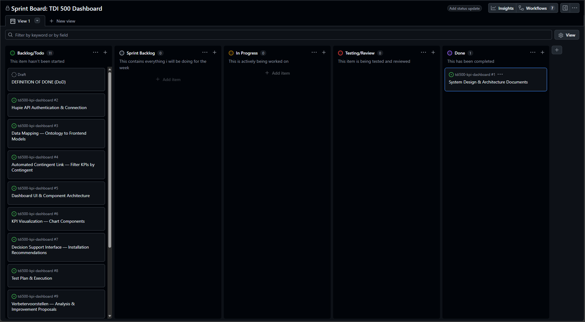

De volledige lijst van user stories met titels, statussen en links naar de GitHub Issues staat in 1.2 (User stories met acceptatiecriteria).

## 1.5 Scrumboard screenshots (dagelijks)

Tijdens de sprint zijn niet voor elke werkdag scrumboard-screenshots vastgelegd. Voor de eerste drie sprintdagen (16, 17 en 18 maart) zijn er beelden bewaard; deze tonen samen de voortgang van de eerste twee user stories die zijn opgepakt. Voor de overige sprintdagen is de daadwerkelijke voortgang afleidbaar uit de GitHub-issuesgeschiedenis (sluitdatums per issue) en de commit-history op de feature-branches.

#### Dag 1 — Maandag 16 maart


Aan het einde van dag 1 staan alle 11 user stories in **Backlog/Todo**. Story #1 (System Design & Architecture Documents) is al verplaatst naar **Done** — deze ontwerptaak is op dag 1 zelf opgepakt en afgerond. De rest van de stories wacht nog op verdere planning.

#### Dag 2 — Dinsdag 17 maart

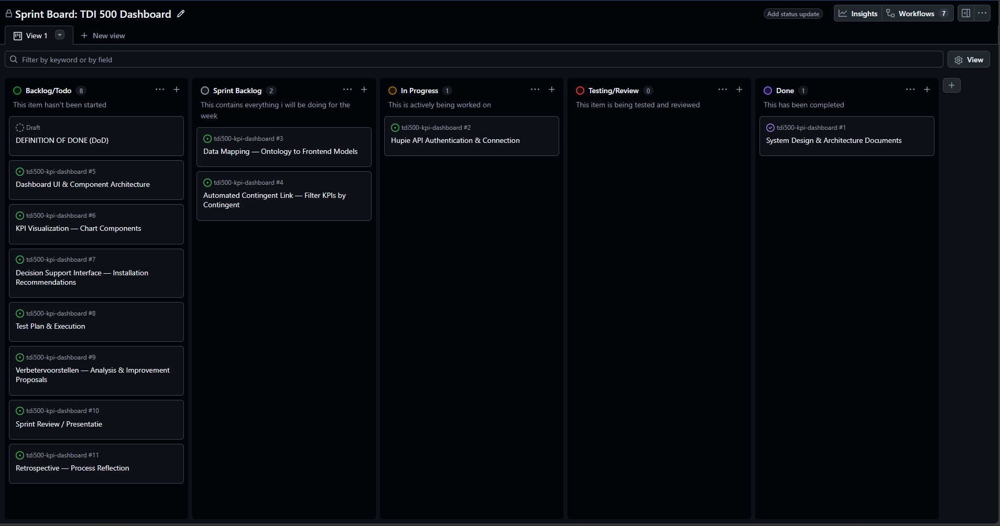

Op dag 2 is story #2 (Hupie API Authentication & Connection) opgepakt en staat nu in **In Progress**. Stories #3 en #4 zijn vanuit de Backlog naar de **Sprint Backlog** verplaatst om voor te bereiden op de komende dagen.

#### Dag 3 — Woensdag 18 maart

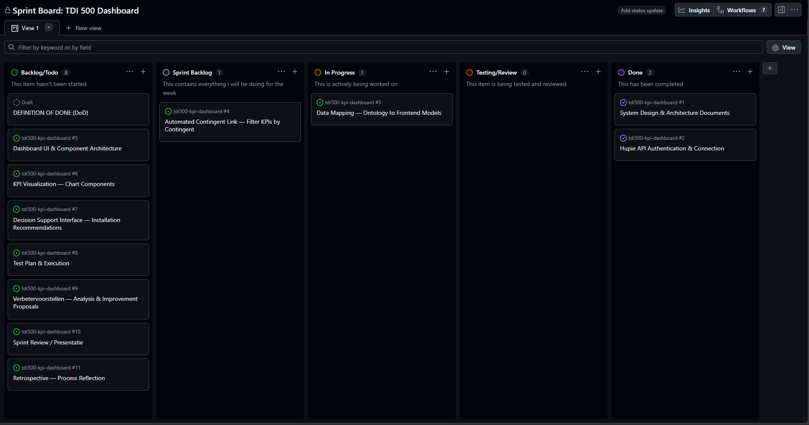

Op dag 3 is story #2 afgerond en naar **Done** verplaatst, en is story #3 (Data Mapping — Ontology to Frontend Models) opgepakt in **In Progress**. Story #4 staat klaar in de Sprint Backlog. De API-verbinding werkt nu en het werk verschuift naar het mappen van inkomende data naar het frontend-datamodel.

#### Dag 4 t/m dag 10

Voor de overige sprintdagen zijn geen scrumboard-screenshots beschikbaar. De voortgang in deze periode is af te leiden uit de sluitdatums van de GitHub-issues (#3 op 31 maart, #4 op 2 april, #5 op 6 april, #6 op 6 april, #7 op 9 april) en uit de commit-geschiedenis op de feature-branches. De volledige lijst staat in 1.2.

In hoofdstuk 4 (Verbetervoorstellen) is dit als VV-21 opgenomen: in een toekomstige sprint zou ik dagelijkse scrumboard-screenshots als vaste werkroutine vastleggen, zodat het procesbewijs volledig is.

## 1.6 Wireframes

In de planweek voor de sprint heb ik wireframes gemaakt in Figma voor de belangrijkste pagina's van het dashboard. Hieronder staan de uitgewerkte schermen, gegroepeerd per pagina-type.

### Hoofddashboard

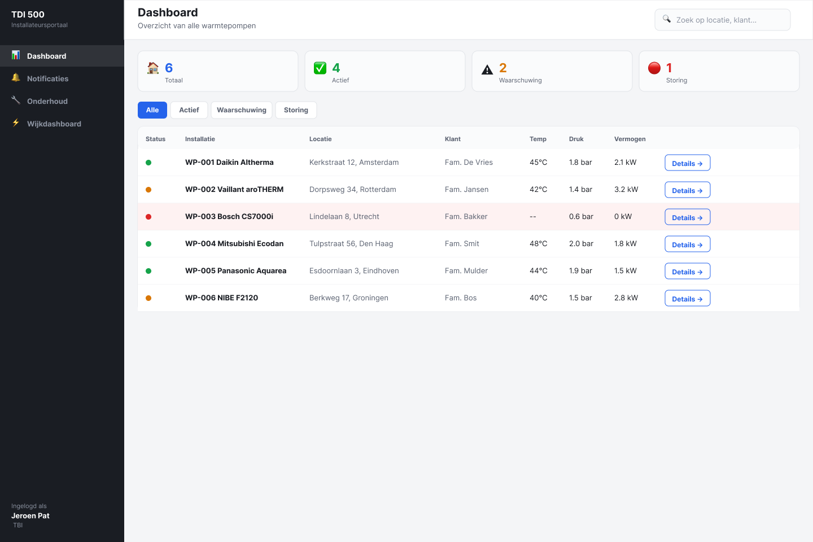

Het hoofddashboard toont een overzicht van alle warmtepompen en de geaggregeerde KPI's per contingent. Bovenaan staan filterknoppen voor isolatie- en aanvoertemperatuurklasse (de twee assen van het kruisprofiel); daaronder de KPI-cards en grafieken.

### Detailpagina per contingent

De detailpagina voor een specifiek contingent is opgebouwd uit meerdere tabbladen, elk met een eigen focus. Hieronder staan de wireframes per tab.

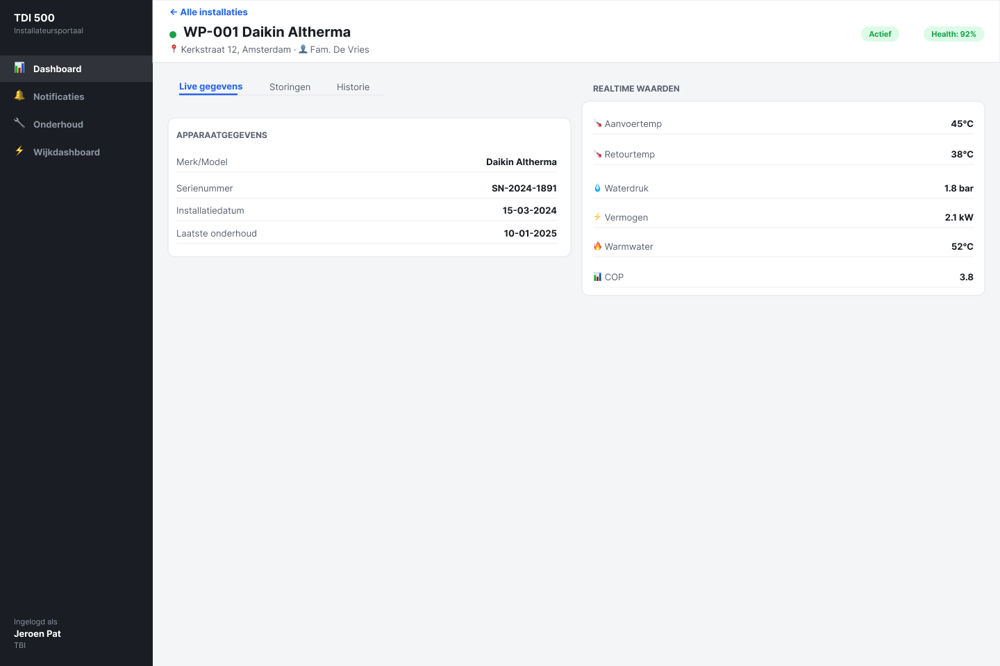

De **Live-tab** toont real-time telemetrie per warmtepomp in het contingent: aanvoertemperatuur, retourtemperatuur, COP, en de actuele storingen.

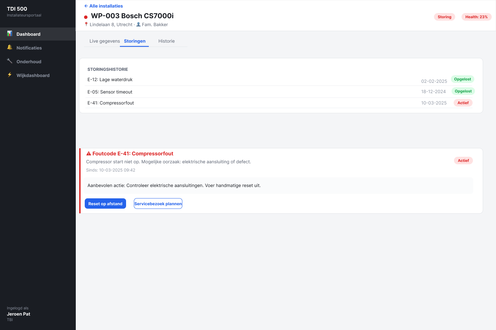

De **Storingen-tab** geeft een filterbare lijst van actuele en historische storingen, met foutcodes en tijdstempels.

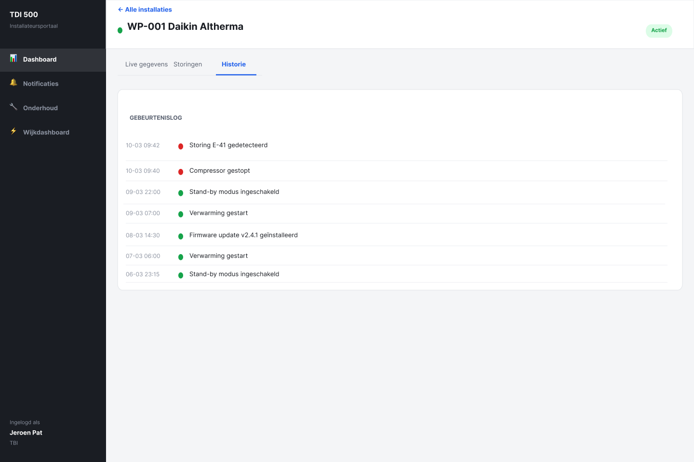

De **Historie-tab** laat een tijdlijn zien van gebeurtenissen per warmtepomp in het contingent.

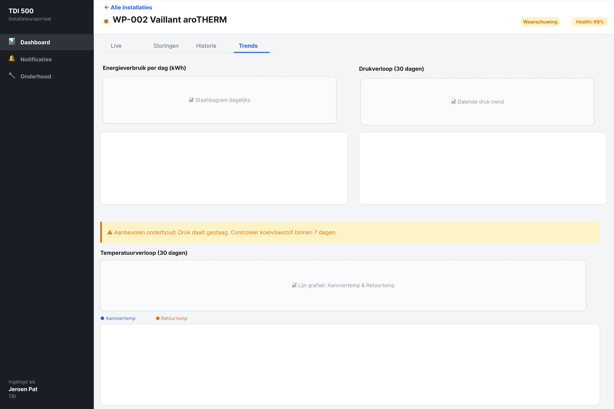

De **Trends-tab** toont grafieken van sensorwaarden over de tijd (temperatuur, druk, energieverbruik), zodat afwijkingen visueel kunnen worden gespot.

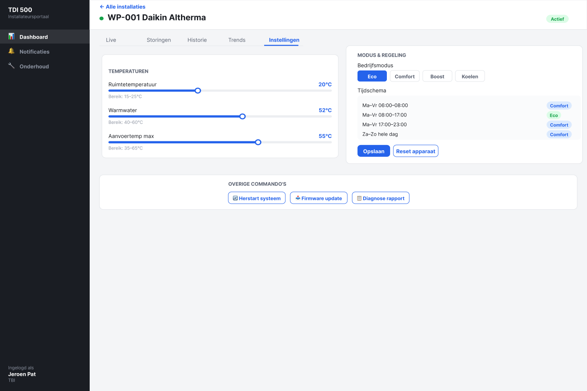

De **Instellingen-tab** is bedoeld voor het op afstand wijzigen van warmtepompinstellingen (setpoints, stooklijn).

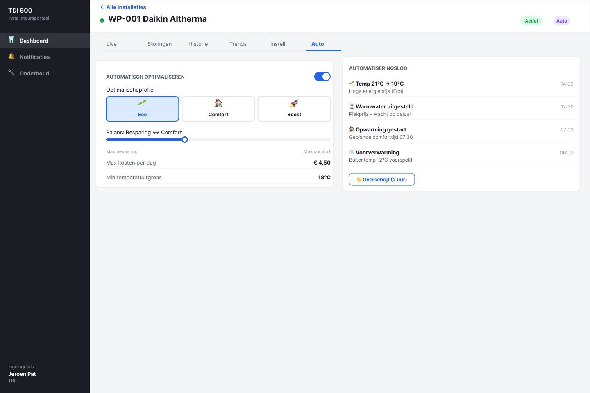

De **Automatisering-tab** schetst hoe automatische optimalisatie en regels per contingent gepresenteerd zouden worden (fase 4-functionaliteit uit het projectplan).

### Schermen voor latere fases

De volgende twee wireframes zijn geschetst voor functionaliteit die buiten deze sprintscope viel, maar wel deel uitmaakt van de bredere TDI 500-visie (zie hoofdstuk 1.1, fases 2 en 5 van het projectplan):

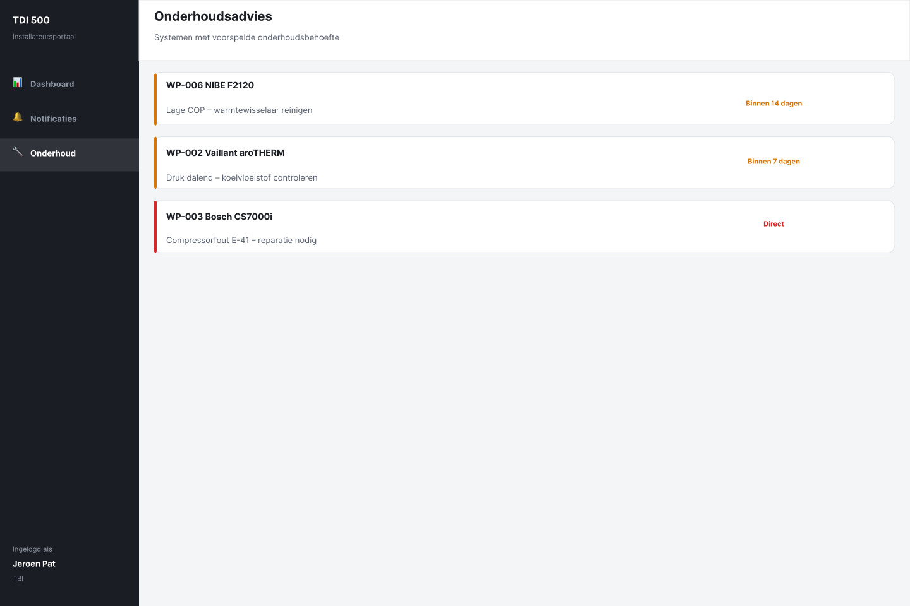

Het **Onderhoudsscherm** hoort bij fase 2 (predictive maintenance) en toont een planning van voorspeld onderhoud per warmtepomp.

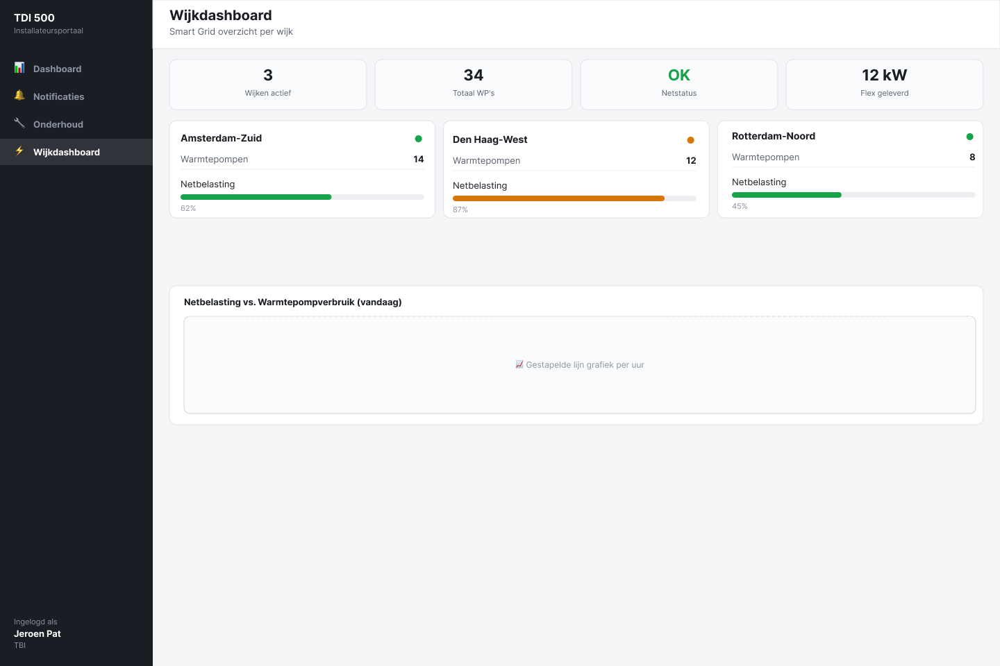

Het **Wijkdashboard** hoort bij fase 5 (smart grid integratie) en toont KPI's geaggregeerd op wijkniveau in plaats van per contingent.

### Mobiele en tablet wireframes

In de wireframe-set zijn nog geen aparte ontwerpen voor mobiel en tablet uitgewerkt. De responsive implementatie volgt de breakpoints van Material UI (MUI), die de layout automatisch herschikt op kleinere schermen. Dat werkt voor de huidige Proof of Concept, maar voor een productieversie zou ik aparte mobile-first wireframes opstellen. Dit is als verbetervoorstel VV-22 opgenomen in hoofdstuk 4.

### Path A: ontbrekende wireframes

De wireframes zijn gemaakt vóór de Path A-uitbreidingen. Voor de BAG-opzoekpagina (`/bag-lookup`) en de rolwisselaar zijn dus geen wireframes beschikbaar; deze schermen zijn rechtstreeks in code uitgewerkt op basis van iteratief overleg met de praktijkbegeleider.

## 1.7 Sitemap / Routing structure

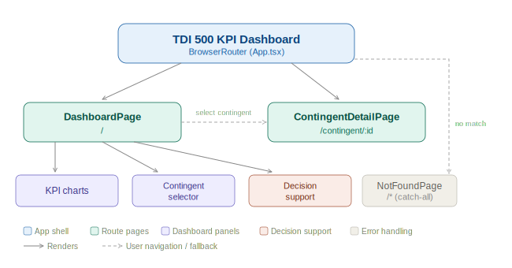

*Dit diagram laat zien welke routes de applicatie aan het begin van de sprint had. Tijdens Path A is de route `/bag-lookup` toegevoegd voor de installateur-flow; die staat hier nog niet op.*

## 1.8 Componentendiagram

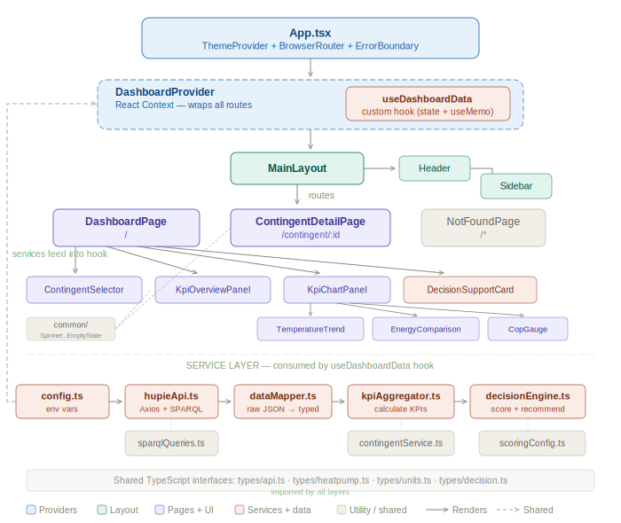

*Dit diagram toont de hoofdstructuur van de React-applicatie: providers (`ThemeProvider`, `DashboardProvider`), de `MainLayout` met `Header` en `Sidebar`, de pagina-componenten, en de servicelaag (`hupieApi`, `dataMapper`, `kpiAggregator`, `decisionEngine`, `contingentService`). De Path A-uitbreidingen `BagLookupPage`, `RoleAwareLanding` en de rolwisselaar staan nog niet op het diagram.*

## 1.9 UML Class Diagram (TypeScript Interfaces)

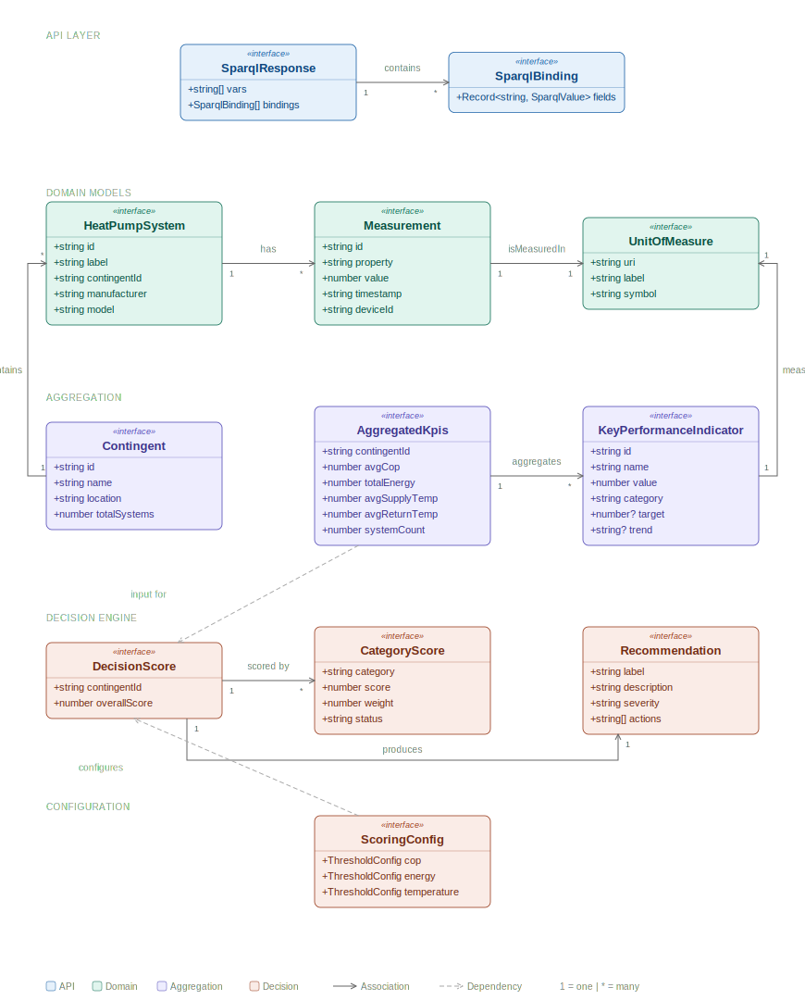

*Dit diagram is gemaakt aan het begin van de sprint (16 maart). Tijdens de sprint heb ik het model op meerdere punten aangepast omdat ik tegen de echte data van de Hupie API aanliep. Daarna zijn er in de Path A-uitbreidingen ook nieuwe types bij gekomen. De belangrijkste verschillen met de huidige code in `src/types/` zijn:*

*`HeatPumpSystem` is uitgebreid: in het diagram staan 5 velden, in de code zijn dat er nu 13 (zoals `measurements[]`, `errorCodes[]` en `kruisProfielCode`). `Measurement` is juist simpeler geworden. `UnitOfMeasure` heb ik helemaal vervangen door een lookup-tabel (`UNIT_MAP`), omdat een eigen interface voor eenheden te ingewikkeld werd voor wat het deed. Het Decision Engine-model is opnieuw opgezet: `DecisionScore` slaat nu een uitspraak per factor op (bijvoorbeeld "COP is acceptabel") in plaats van één score per contingent.*

*Daarnaast zijn er voor Path A-uitbreidingen ongeveer 20 nieuwe types bij gekomen, vooral voor de kruisprofielen, de TNO-catalogus en de BAG-opzoekketen. Ik heb ervoor gekozen om het diagram niet bij te werken: het laat zien wat ik aan het begin had bedacht, en de huidige stand staat in de code zelf.*

## 1.10 Dataflow-diagram

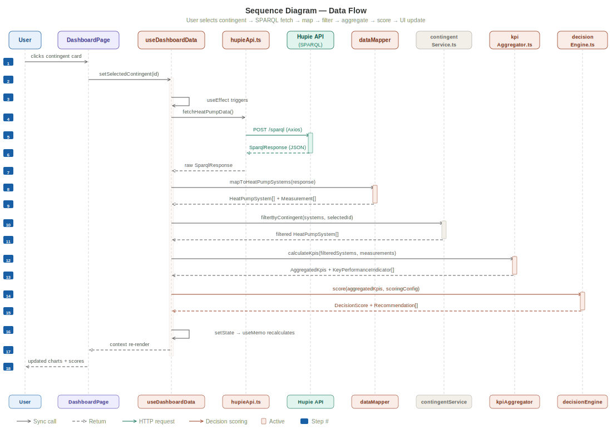

*Dit diagram laat de volgorde zien waarin een gebruiker via de UI een SPARQL-query aanroept en de data terugkrijgt: `User → DashboardPage → Hupie API → dataMapper → contingentService → kpiAggregator → decisionEngine → UI`. De stroom klopt nog steeds met de huidige code, alleen begint de flow nu eerst bij `RoleAwareLanding` voordat `DashboardPage` geladen wordt.*

## 1.11 Onderbouwing technologiekeuzes

*Bron: [docs/Onderbouwing_Technologiekeuzes_TDI500.docx](Onderbouwing_Technologiekeuzes_TDI500.docx). Inhoud opgesteld 13 maart 2026 voor sprintstart, met één post-sprint correctie (`/about` → `/bag-lookup`).*

Hieronder worden de technologiekeuzes voor het TDI 500 KPI Dashboard onderbouwd. Per keuze wordt beschreven waarom de technologie is gekozen, welke alternatieven zijn overwogen, en waarom die alternatieven niet zijn gekozen.

#### 1. Frontend Framework: React 18 met TypeScript

##### Waarom React 18?

React is gekozen als frontend framework vanwege de component-based architectuur. Het dashboard bestaat uit meerdere onafhankelijke onderdelen (contingentselectie, KPI-kaarten, grafieken, beslissingsadvies) die elk als herbruikbaar component kunnen worden gebouwd en los van elkaar kunnen worden ontwikkeld en getest.

React heeft een groot ecosysteem met uitgebreide ondersteuning voor de bibliotheken die nodig zijn in dit project (Material UI, ApexCharts, React Router). Daarnaast bieden React Hooks (useState, useMemo, useContext) een overzichtelijke manier om state management en afgeleide data te beheren zonder externe state-bibliotheken.

##### Waarom TypeScript (strict mode)?

TypeScript is essentieel voor dit project omdat de data afkomstig is van een externe SPARQL API met een complexe ontologiestructuur (HCO/SAREF). Zonder TypeScript zou het makkelijk zijn om fouten te maken bij het mappen van ruwe API-data naar bruikbare frontend-objecten. Met TypeScript worden alle interfaces (Measurement, Contingent, KeyPerformanceIndicator, etc.) expliciet gedefinieerd, waardoor fouten bij het compileren al worden ontdekt in plaats van pas in de browser.

Strict mode is ingeschakeld om het gebruik van het type “any” te voorkomen, wat de betrouwbaarheid van de ontologie-mapping vergroot.

##### Overwogen alternatieven

|  |  |  |
|----|----|----|
| **Technologie** | **Voordelen** | **Nadelen / Reden niet gekozen** |
| **React 18 + TypeScript (gekozen)** | Component-based, groot ecosysteem, Hooks voor state, TypeScript voor type safety bij ontologie-mapping | — |
| Vue.js 3 + TypeScript | Lichtgewicht, goede documentatie, Composition API vergelijkbaar met Hooks | Kleiner ecosysteem voor data-dashboards. Minder libraries specifiek voor KPI-visualisatie. TypeScript-integratie is verbeterd maar historisch minder volwassen dan bij React. |
| Angular | Volledig framework met ingebouwde routing, forms, HTTP client. TypeScript standaard. | Te zwaar voor een Proof of Concept. Langere opstarttijd, steile leercurve. Overkill voor een dashboard dat primair data visualiseert. |
| Vanilla JavaScript | Geen framework overhead, maximale controle | Geen componentstructuur, geen state management, geen type safety. Zou leiden tot ongestructureerde code die moeilijk te onderhouden en te testen is. Niet geschikt voor een applicatie met meerdere interactieve views. |

#### 2. UI Component Library: Material UI (MUI v5)

##### Waarom MUI?

Material UI is gekozen omdat het een uitgebreide set van kant-en-klare, professionele UI-componenten biedt die direct bruikbaar zijn voor een dashboard: Cards voor KPI-overzichten, Grid voor responsive layouts, AppBar en Drawer voor navigatie, en Tables voor data-weergave.

MUI biedt een theming-systeem waarmee een custom kleurenpalet en typografie centraal worden gedefinieerd. Dit zorgt ervoor dat het hele dashboard er consistent uitziet zonder dat kleuren en stijlen verspreid door de code worden gedefinieerd.

Daarnaast heeft MUI ingebouwde ondersteuning voor responsive design via Grid breakpoints (xs, sm, md, lg), wat het eenvoudig maakt om het dashboard bruikbaar te maken op zowel desktop als tablet.

##### Overwogen alternatieven

|  |  |  |
|----|----|----|
| **Technologie** | **Voordelen** | **Nadelen / Reden niet gekozen** |
| **Material UI v5 (gekozen)** | Groot componentenaanbod, theming-systeem, responsive Grid, goede TypeScript support, veel documentatie | — |
| Chakra UI | Schone API, goede toegankelijkheid, eenvoudig te customizen | Kleiner ecosysteem, minder complexe componenten beschikbaar (bijv. geen ingebouwde DataGrid). Minder verspreid in de industrie, waardoor er minder voorbeelden en community-support beschikbaar zijn voor dashboard-specifieke patronen. |
| Ant Design | Uitgebreid componentenaanbod, sterk in tabellen en formulieren | Stijl is sterk gericht op Chinese markt, moeilijker te customizen naar een Europees/Nederlands uiterlijk. Grotere bundle size. TypeScript support is goed maar de documentatie is soms lastig te navigeren. |
| Tailwind CSS | Utility-first, maximale flexibiliteit, kleine bundle | Geen kant-en-klare componenten. Elk UI-element moet zelf worden opgebouwd, wat voor een PoC met beperkte tijd te veel werk is. Vereist meer CSS-kennis voor een professioneel resultaat. |

#### 3. Datavisualisatie: ApexCharts (react-apexcharts)

##### Waarom ApexCharts?

ApexCharts is gekozen vanwege de combinatie van interactiviteit en eenvoud. Het dashboard moet KPI-data visualiseren in verschillende chart-types (lijngrafieken voor temperatuurtrends, staafdiagrammen voor energieverbruik, meters voor COP-scores), en ApexCharts ondersteunt al deze types met een uniforme API.

ApexCharts biedt ingebouwde interactiviteit: tooltips bij hover, zoom op tijdreeksen, en exportfunctionaliteit. De react-apexcharts wrapper integreert direct met React’s component-model, waardoor charts automatisch re-renderen wanneer de data verandert (bijvoorbeeld bij het wisselen van contingent).

Daarnaast biedt ApexCharts een responsive configuratie waarmee charts zich automatisch aanpassen aan verschillende schermformaten, wat belangrijk is voor de tablet-ondersteuning.

##### Overwogen alternatieven

|  |  |  |
|----|----|----|
| **Technologie** | **Voordelen** | **Nadelen / Reden niet gekozen** |
| **ApexCharts (gekozen)** | Meerdere chart-types, interactief (tooltips, zoom), responsive, React wrapper beschikbaar, eenvoudige API | — |
| Recharts | React-native, declaratieve API, populair in React-projecten | Minder chart-types beschikbaar (geen gauge/radial chart standaard). Minder interactiviteit out-of-the-box. Voor het COP-gauge component zou een apart library nodig zijn. |
| Chart.js (react-chartjs-2) | Lichtgewicht, breed ondersteund, veel voorbeelden | Minder interactief dan ApexCharts. Gauge charts vereisen plugins. De React-wrapper is minder volwassen dan react-apexcharts. |
| D3.js | Maximale flexibiliteit, kan elke visualisatie bouwen | Te laagdrempelig voor een PoC. D3 vereist handmatige DOM-manipulatie, wat conflicteert met React’s virtual DOM. De leercurve is steil en de ontwikkeltijd voor standaard charts is veel hoger dan bij ApexCharts. |

#### 4. HTTP Client: Axios

##### Waarom Axios?

Axios is gekozen als HTTP client voor de communicatie met de Hupie SPARQL API. Axios biedt voordelen ten opzichte van de ingebouwde fetch API: automatische JSON-parsing, een ingebouwde timeout-configuratie, interceptors voor foutafhandeling, en een overzichtelijke API voor het instellen van headers (nodig voor API-authenticatie).

Voor dit project is de timeout-configuratie bijzonder relevant: de SPARQL-queries naar de Hupie API kunnen complex zijn, en een configureerbare timeout (via de centralized config module) voorkomt dat de applicatie onbeperkt blijft wachten op een response.

##### Overwogen alternatieven

|  |  |  |
|----|----|----|
| **Technologie** | **Voordelen** | **Nadelen / Reden niet gekozen** |
| **Axios (gekozen)** | Automatische JSON-parsing, timeout-configuratie, interceptors voor error handling, overzichtelijke API | — |
| Fetch API (ingebouwd) | Geen extra dependency, standaard in alle browsers | Geen ingebouwde timeout (moet handmatig met AbortController). Geen automatische JSON-parsing (vereist response.json() aanroep). Error handling is minder intuïtief: fetch reject alleen bij netwerk-fouten, niet bij HTTP 4xx/5xx responses. Voor een project met meerdere API-aanroepen en foutscenario’s leidt dit tot meer boilerplate code. |

#### 5. Testing Framework: Vitest

##### Waarom Vitest?

Vitest is gekozen voor de geautomatiseerde unit tests van de data- en logica-laag (dataMapper, kpiAggregator, decisionEngine). Vitest is compatibel met de Vite-bundler die in veel React-projecten wordt gebruikt, en biedt een snelle test-uitvoering dankzij native ES-module support.

De test-syntax is vrijwel identiek aan Jest (describe, it, expect), waardoor bestaande kennis direct toepasbaar is. Het verschil is dat Vitest sneller opstart en beter integreert met moderne TypeScript-projecten zonder extra configuratie.

Vitest is van het begin af aan gekozen voor de logica-tests. Playwright heb ik later in het project toegevoegd, toen ik besloot om de UI-tests te automatiseren in plaats van ze alleen handmatig te doen. Dat was een bewuste uitbreiding tijdens de testfase: ik merkte dat handmatig klikken niet genoeg zekerheid gaf en dat geautomatiseerde browsertests de foutscenario's veel betrouwbaarder konden afdekken. Deze keuze werk ik verder uit in hoofdstuk 3 en kom ik als leerpunt terug in hoofdstuk 4.

##### Overwogen alternatieven

|  |  |  |
|----|----|----|
| **Technologie** | **Voordelen** | **Nadelen / Reden niet gekozen** |
| **Vitest (gekozen)** | Snelle opstarttijd, native TypeScript/ESM support, Jest-compatibele syntax, geen extra configuratie nodig | — |
| Jest | Industrie-standaard, veel documentatie, breed ondersteund | Langzamere opstarttijd, vereist extra configuratie voor TypeScript en ESM-modules (ts-jest of @swc/jest). Voor een project met een beperkt aantal unit tests weegt het voordeel van Jest’s grotere ecosysteem niet op tegen de snelheid en eenvoud van Vitest. |

#### 6. Routing: React Router v6

##### Waarom React Router?

React Router is gekozen om de applicatie op te delen in meerdere navigeerbare pagina’s: een hoofddashboard (`/`), een detailpagina per contingent (`/contingent/:id`), en een BAG-opzoekpagina voor installateurs (`/bag-lookup`). De `/about` route die oorspronkelijk gepland was, is tijdens de sprint geschrapt omdat een dashboardapplicatie geen aparte informatiepagina nodig had. Dit biedt een betere gebruikerservaring dan alles op één pagina plaatsen, en maakt het mogelijk om direct naar een specifiek contingent te linken via de URL.

React Router v6 is de standaard routing-oplossing voor React-applicaties. Het is lichtgewicht, integreert naadloos met React’s component-model, en biedt dynamische route-parameters (/:id) die nodig zijn voor de contingent-detailpagina.

Er zijn geen serieuze alternatieven overwogen omdat React Router de de facto standaard is voor client-side routing in React. Alternatieven zoals TanStack Router bestaan maar zijn minder verspreid en zouden voor een PoC geen meerwaarde bieden.

#### Samenvatting

Alle technologiekeuzes zijn gemaakt op basis van drie criteria: geschiktheid voor het type applicatie (data-dashboard met externe API), ontwikkelsnelheid (PoC met beperkte tijd), en betrouwbaarheid (type safety, error handling, geautomatiseerd testen). Bij elke keuze is minimaal één alternatief overwogen en is de afweging beschreven.

|  |  |  |
|----|----|----|
| **Categorie** | **Gekozen** | **Overwogen alternatieven** |
| Frontend Framework | **React 18 + TypeScript** | Vue.js 3, Angular, Vanilla JS |
| UI Library | **Material UI v5** | Chakra UI, Ant Design, Tailwind |
| Datavisualisatie | **ApexCharts** | Recharts, Chart.js, D3 |
| HTTP Client | **Axios** | Fetch API |
| Testing | **Vitest** | Jest |
| Routing | **React Router v6** | (de facto standaard) |

## 1.12 Onderbouwing ethiek, privacy en security

*Bron: [docs/Onderbouwing_Ethiek_Privacy_Security_TDI500.docx](Onderbouwing_Ethiek_Privacy_Security_TDI500.docx). Inhoud opgesteld 13 maart 2026 voor sprintstart.*

Dit document beschrijft hoe het TDI 500 KPI Dashboard omgaat met ethische verantwoordelijkheid, privacybescherming en informatiebeveiliging. Per onderwerp worden de risico’s, de genomen maatregelen en de onderbouwing van de keuzes beschreven.

#### 1. Privacy

##### 1.1 Context en risico’s

Het TDI 500 KPI Dashboard haalt data op via de Hupie SPARQL API. Deze data bevat meetgegevens van warmtepompen die geïnstalleerd zijn in woningen. In theorie zou deze data herleidbaar kunnen zijn tot specifieke huishoudens als er een koppeling wordt gemaakt tussen een warmtepompsysteem, een adres en een bewoner.

De risico’s zijn:

• Herleidbaarheid: als individuele warmtepompsystemen gekoppeld worden aan specifieke adressen, zou het mogelijk zijn om het energieverbruik van een specifiek huishouden te achterhalen.

• Profilering: langdurige meetdata (temperaturen, energieverbruik, storingen) kan patronen onthullen over bewonersgedrag, zoals aanwezigheid of afwezigheid.

• Datalekken: als API-credentials uitlekken, zou een onbevoegde partij toegang kunnen krijgen tot de volledige dataset.

##### 1.2 Genomen maatregelen

**Aggregatie op contingentniveau**

Het dashboard toont geen data op het niveau van individuele woningen of huishoudens. Alle KPI’s worden geaggregeerd op contingentniveau: groepen van vergelijkbare woningtypen. De gebruiker ziet gemiddelden, totalen en percentages over een groep warmtepompen, niet over een individueel systeem. Dit is een bewuste ontwerpkeuze die privacy by design implementeert.

**Geen persoonlijke gegevens**

Het dashboard verwerkt geen namen, adressen, telefoonnummers of andere persoonsgegevens. BAG-referenties (Basisregistratie Adressen en Gebouwen) worden alleen op contingentniveau gebruikt om groepen woningen te identificeren, niet om individuele adressen weer te geven.

**Geen opslag van data in de frontend**

Het dashboard slaat geen data lokaal op (geen localStorage, geen cookies, geen lokale database). Alle data wordt opgehaald van de Hupie API bij elk bezoek en alleen in het werkgeheugen van de browser bewaard. Zodra de gebruiker de pagina sluit, is de data verdwenen.

**Minimale data-opvraging**

De SPARQL-queries zijn zo geschreven dat alleen de data wordt opgehaald die nodig is voor de KPI-berekeningen. Er worden geen overbodige velden of datasets binnengehaald.

##### 1.3 AVG-overwegingen

Op basis van de huidige opzet verwerkt het dashboard geen persoonsgegevens in de zin van de AVG (Algemene Verordening Gegevensbescherming), omdat alle data geanonimiseerd en geaggregeerd is. Mocht in een toekomstige versie de data wel herleidbaar worden tot individuen (bijvoorbeeld bij het toevoegen van adres-level detail), dan zou een Data Protection Impact Assessment (DPIA) nodig zijn en zouden aanvullende maatregelen getroffen moeten worden.

#### 2. Security (Informatiebeveiliging)

##### 2.1 Context en risico’s

Het dashboard communiceert met een externe API (Hupie) waarvoor authenticatie vereist is. De belangrijkste beveiligingsrisico’s zijn:

• Credential-lekken: als de API-sleutel in de broncode terechtkomt (bijvoorbeeld via een git commit), kan iedereen met toegang tot de repository de API benaderen.

• Man-in-the-middle: als de communicatie niet versleuteld is, kan een aanvaller de data onderscheppen of manipuleren.

• Onbevoegde toegang: als de applicatie geen goede foutafhandeling heeft, zouden foutmeldingen gevoelige informatie kunnen onthullen (zoals de API-URL of interne structuur).

##### 2.2 Genomen maatregelen

|  |  |  |
|----|----|----|
| **Maatregel** | **Implementatie** | **Waarom** |
| Environment variables | API-URL en API-key worden opgeslagen in een .env bestand dat NIET in de git repository wordt opgenomen. Een .env.example bestand toont welke variabelen nodig zijn, zonder de daadwerkelijke waarden. | Voorkomt dat credentials in de broncode of git-geschiedenis terechtkomen. Zelfs als de repository openbaar zou worden, zijn de credentials niet zichtbaar. |
| .gitignore | Het. env bestand is expliciet opgenomen in .gitignore. Dit wordt gecontroleerd bij elke commit. | Extra vangnet: zelfs als een ontwikkelaar per ongeluk git add . uitvoert, wordt het .env bestand niet meegenomen. |
| Gecentraliseerde config | Een config/index.ts module leest de environment variables en exporteert ze als een getypt object. Alle services lezen uit deze module, niet direct uit process.env. | Voorkomt dat environment variables verspreid door de code worden gelezen. Maakt het eenvoudig om ontbrekende variabelen te detecteren bij het opstarten. |
| HTTPS | Alle communicatie met de Hupie API verloopt via HTTPS (TLS-versleuteling). | Voorkomt dat data of credentials onderschept kunnen worden tijdens transport (man-in-the-middle bescherming). |
| Foutafhandeling | Foutmeldingen in de UI tonen gebruiksvriendelijke berichten ("Er is een fout opgetreden"), niet de technische details van de API (geen URLs, geen stack traces, geen credentials). | Voorkomt information disclosure: een aanvaller kan geen interne structuur afleiden uit foutmeldingen. |
| Timeout-configuratie | API-aanroepen hebben een configureerbare timeout (standaard 10 seconden). Als de API niet reageert, wordt de aanroep afgebroken. | Voorkomt dat de applicatie onbeperkt blijft wachten, wat zowel een gebruikerservaring- als een beveiligingsrisico is (denial of service bij een trage API). |
| ErrorBoundary | Een React ErrorBoundary component vangt runtime-fouten op en toont een fallback-pagina in plaats van een witte pagina of een stack trace. | Voorkomt dat technische foutinformatie aan de eindgebruiker wordt getoond. Houdt de applicatie bruikbaar bij onverwachte fouten. |

##### 2.3 Buiten scope (bewust)

De volgende beveiligingsmaatregelen zijn bewust buiten scope gelaten voor deze Proof of Concept, maar zouden in een productieversie geïmplementeerd moeten worden:

• Gebruikersauthenticatie en -autorisatie (login, rollen, toegangscontrole)

• Content Security Policy (CSP) headers

• Rate limiting op API-aanroepen

• Audit logging van API-aanroepen

• Penetratietesting

Deze punten worden benoemd in de verbetervoorstellen (sectie 4 van het examenverslag).

#### 3. Ethiek

##### 3.1 Context

Het TDI 500 KPI Dashboard is een beslissingsondersteunend hulpmiddel. Installateurs en planners gebruiken de gepresenteerde data om keuzes te maken over welk installatieconcept het meest geschikt is voor een woningcontingent. Dit betekent dat de manier waarop data wordt gepresenteerd direct invloed heeft op beslissingen die financiële en maatschappelijke gevolgen hebben.

Als de data misleidend wordt gepresenteerd — bewust of onbewust — kan dat leiden tot verkeerde installatiebeslissingen, verspilling van middelen, of het benadelen van bepaalde woninggroepen.

##### 3.2 Eerlijke datavisualisatie

**Het dashboard hanteert de volgende principes voor eerlijke visualisatie:**

|  |  |  |
|----|----|----|
| **Principe** | **Implementatie** | **Wat het voorkomt** |
| Y-as begint bij nul (staafdiagrammen) | Alle staafdiagrammen (bar charts) in het dashboard beginnen de Y-as altijd bij 0. Dit is hard gecodeerd in de chart-configuratie. | Een staafdiagram dat niet bij 0 begint kan kleine verschillen visueel enorm overdrijven. Een verschil van 3000 vs 3100 kWh lijkt op het dubbele als de as bij 2900 begint. |
| Duidelijke aslabels met eenheden | Alle assen hebben een label met de meeteenheid (°C, kWh, kW, %). Geen as zonder label. | Voorkomt dat de gebruiker de schaal verkeerd interpreteert. Een getal "45" zonder eenheid is waardeloos. |
| Geen cherry-picking | Alle warmtepompen in het geselecteerde contingent worden getoond. Er worden geen systemen uitgefilterd om het gemiddelde beter te laten lijken. | Voorkomt selectieve presentatie die een vertekend beeld geeft van de werkelijke prestaties. |
| Toegankelijke kleuren | Het dashboard gebruikt niet alleen kleur om informatie over te brengen. Naast groen/geel/rood worden ook iconen en tekstlabels gebruikt (goed/acceptabel/slecht). | Ongeveer 8% van de mannen heeft een kleurenblindheid. Alleen kleur gebruiken sluit deze gebruikers uit. |
| Correcte schalen | Lijngrafieken gebruiken een passende min/max voor de Y-as op basis van de daadwerkelijke waarden, niet een willekeurige schaal. | Een temperatuurgrafiek met een schaal van 0–100°C terwijl alle waarden tussen 35–55°C liggen zou de variatie onzichtbaar maken. De schaal moet passen bij de data. |

##### 3.3 Beslissingsondersteuning, geen beslissing

Het Decision Support-component van het dashboard geeft een aanbeveling (goed/ acceptabel / slecht) op basis van de geaggregeerde KPI’s. Het is belangrijk dat deze aanbeveling wordt gepresenteerd als ondersteuning, niet als een definitief oordeel.

Concrete maatregelen:

• De aanbeveling wordt expliciet gelabeld als "beslissingsondersteuning" (niet als "conclusie" of "oordeel").

• Een disclaimer is zichtbaar: "Dit advies is gebaseerd op beschikbare meetdata en dient als ondersteuning, niet als definitief oordeel."

• De scoringscriteria en drempelwaarden zijn transparant en zichtbaar voor de gebruiker. Het is geen black box.

• Als de datakwaliteit laag is (weinig meetpunten, korte tijdsperiode), communiceert het dashboard dit expliciet in plaats van toch een aanbeveling te geven met vals vertrouwen.

##### 3.4 Verantwoord omgaan met data van derden

De data in het dashboard is afkomstig van de Hupie API, die is ontwikkeld door een externe partij (Klaas Andries de Graaf). Het dashboard presenteert deze data zo getrouw mogelijk zonder de data te manipuleren, te selecteren, of te interpreteren op een manier die niet door de data wordt ondersteund.

Waar het dashboard berekeningen uitvoert (gemiddelden, totalen, percentages), zijn deze berekeningen standaard statistische bewerkingen die transparant en reproduceerbaar zijn.

#### 4. Samenvatting

|  |  |  |
|----|----|----|
| **Onderwerp** | **Belangrijkste maatregel** | **Risico dat het adresseert** |
| Privacy | Aggregatie op contingentniveau, geen persoonsgegevens, geen lokale opslag | Herleidbaarheid van data tot individuele huishoudens |
| Security | Environment variables, .gitignore, HTTPS, gecentraliseerde config, ErrorBoundary | Credential-lekken, onderschepping, information disclosure |
| Ethiek | Y-as bij 0, duidelijke labels, geen cherry-picking, transparante scoring, disclaimer | Misleidende visualisatie die leidt tot verkeerde installatiebeslissingen |

Deze maatregelen zijn geïmplementeerd als onderdeel van het ontwerpproces (privacy en ethiek by design), niet achteraf toegevoegd. Ze zijn terug te vinden in de code (chart-configuratie, config module, ErrorBoundary), in de architectuur (aggregatielaag, geen lokale opslag), en in de UI (disclaimer, transparante drempelwaarden).

# 2. Realiseren (B1-K1-W3)

## 2.1 Lijst toegewezen user stories

In hoofdstuk 1.2 staat de volledige lijst van 15 user stories die voor deze sprint zijn vastgesteld en opgepakt. Hieronder volgt een compactere blik op wat daadwerkelijk is opgeleverd, gegroepeerd naar type.

### Sprintstories die als werkende functionaliteit zijn opgeleverd

- **#1 System Design & Architecture Documents** — opgeleverd als ontwerpdocumenten in `docs/diagrams/` en de inhoud van hoofdstuk 1 van dit verslag
- **#2 Hupie API Authentication & Connection** — werkende SPARQL-verbinding via Axios met typed errors, rate-limit detectie en two-phase auth-pattern
- **#3 Data Mapping — Ontology to Frontend Models** — service-laag die SPARQL-responses omzet naar typed TypeScript-objecten, met HCO/SAREF unit-resolution
- **#4 Automated Contingent Link — Filter KPIs by Contingent** — filtering van warmtepompen op kruisprofiel met URL-parameter-state
- **#5 Dashboard UI & Component Architecture** — React-applicatie met providers, MainLayout, en pagina-componenten (zie 1.8 voor componentendiagram)
- **#6 KPI Visualization — Chart Components** — ApexCharts-implementatie voor temperatuur-trends, energie-vergelijking en COP-gauge
- **#7 Decision Support Interface — Installation Recommendations** — per-factor scoring met overall verdict en expliciete `insufficient-data` afhandeling

### Documentatie- en ceremoniestories

De stories #8 (Test Plan & Execution), #9 (Verbetervoorstellen), #10 (Sprint Review / Presentatie) en #11 (Retrospective) zijn niet als code-feature opgeleverd maar als onderdelen van dit verslag zelf — respectievelijk in hoofdstuk 3, hoofdstuk 4, en hoofdstuk 6. Op het scrumboard staan deze nog als "open" omdat ze pas formeel sluiten bij oplevering van het verslag.

### Path A-stories (zie 1.2)

Aanvullend zijn vier Path A-stories (#50 t/m #53) na de oorspronkelijke sprintscope opgeleverd: TNO-catalogus-integratie, rolwisselaar, installateur-view met BAG-opzoekketen, en beheerder-view. De timing van deze stories en de honest acknowledgment over de issue-aanmaakdata staan in 1.2.

## 2.2 Screenshots uitgewerkte functionaliteiten

Per feature: een screenshot van de werkende functionaliteit met een korte beschrijving. Sommige screenshots dekken meerdere user stories tegelijk, omdat de bijbehorende UI op één scherm samenkomt. Waar dat zo is, wordt dat in de tekst aangegeven.

De screenshots zijn gemaakt in twee modi:

- **Live** — verbonden met de Hupie API (te zien aan de groene `Hupie API (live)`-badge in de header). Dit toont wat de echte API momenteel oplevert.
- **Mock** — een ingebouwde mock-modus met realistische voorbeelddata (te zien aan de oranje `Mock data`-badge). Dit toont hoe het dashboard eruitziet wanneer alle datavelden gevuld zijn.

De mock-modus is bewust toegevoegd tijdens de sprint, omdat de Hupie API nog niet alle datavelden levert die het dashboard ondersteunt (bijvoorbeeld foutcodes en COP-waarden ontbreken voor sommige pompen). Hierdoor kan het volledige UI-gedrag worden getoond zonder afhankelijk te zijn van data die de API nog niet beschikbaar stelt.

### API-verbinding (story #2)

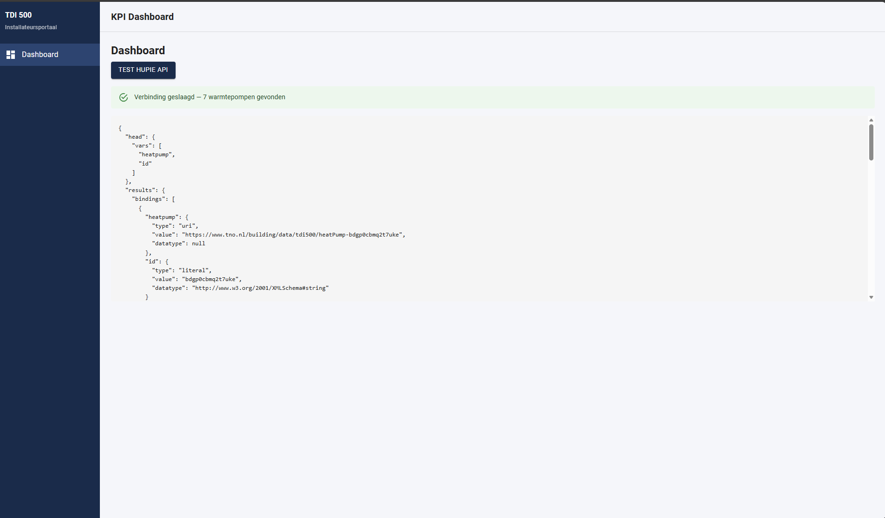

Deze screenshot toont een succesvolle test van de Hupie API-verbinding. De applicatie authenticeert via het two-phase auth-patroon (zie 2.3.2 voor de bijbehorende code) en haalt warmtepompdata op via SPARQL. De `Hupie API (live)`-badge in de header van de overige live-screenshots verwijst hiernaar.

### Hoofddashboard — live data (stories #3, #5, #6, #7)

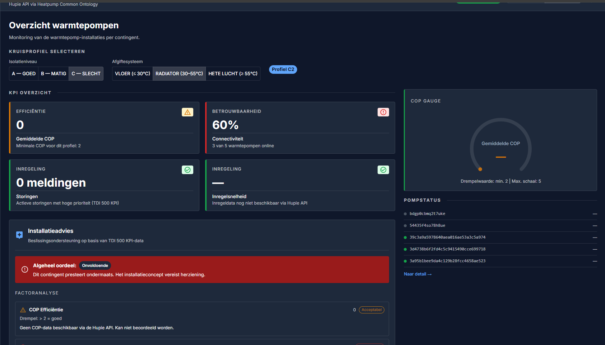

Dit is het hoofddashboard met live data uit de Hupie API, ingesteld op kruisprofiel **C2** (slecht geïsoleerd, radiatorsysteem). Vier KPI-cards bovenaan tonen efficiëntie (COP-gemiddelde), betrouwbaarheid (connectiviteit), en twee inregelingscijfers. De COP Gauge rechts toont het gemiddelde tegenover de profieldrempel. Onderin staat het installatieadvies: bij C2 met de huidige data komt de Decision Engine tot het oordeel **"Onvoldoende"**, met daaronder de factoranalyse die laat zien dat geen COP-data beschikbaar is via de Hupie API.

Deze screenshot toont user story #3 (Data Mapping — de KPI-waarden zijn afkomstig uit getypeerde objecten), story #5 (Dashboard UI — de layout en compositie), story #6 (KPI Visualization — gauge en kaarten), en story #7 (Decision Support — het algeheel oordeel met factoranalyse).

### Hoofddashboard — mock data

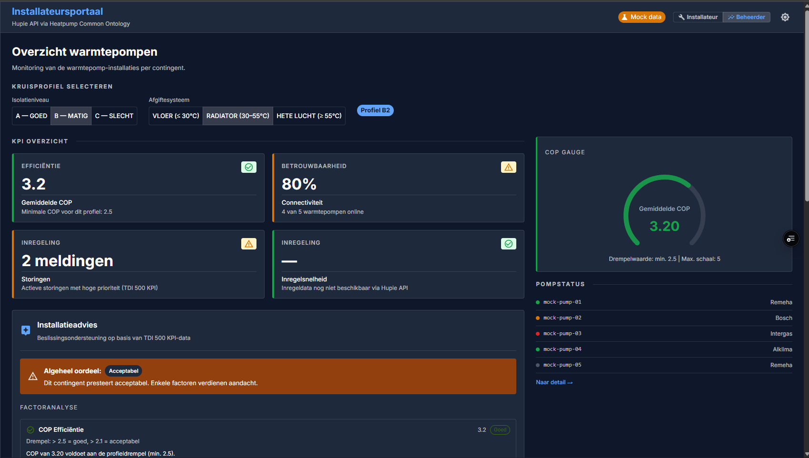

Hetzelfde hoofddashboard in mock-modus, ingesteld op kruisprofiel **B2** (matig geïsoleerd). Hier zijn alle datavelden gevuld: gemiddelde COP van 3.2 (boven de drempel van 2.5), 80% connectiviteit, 2 storingsmeldingen. De Decision Engine komt nu tot het oordeel **"Acceptabel"** — een ander resultaat dan in live-modus, dankzij de rijkere mock-data. De factoranalyse onderin laat zien dat de COP-factor met 3.20 boven de profieldrempel van 2.5 ligt en daarom als "Goed" wordt gescoord.

Door live en mock naast elkaar te tonen wordt zichtbaar dat de UI-laag werkt zoals bedoeld; de variatie in oordeel komt voort uit verschillen in databeschikbaarheid, niet uit verschillen in code.

### KPI-grafieken (story #6)

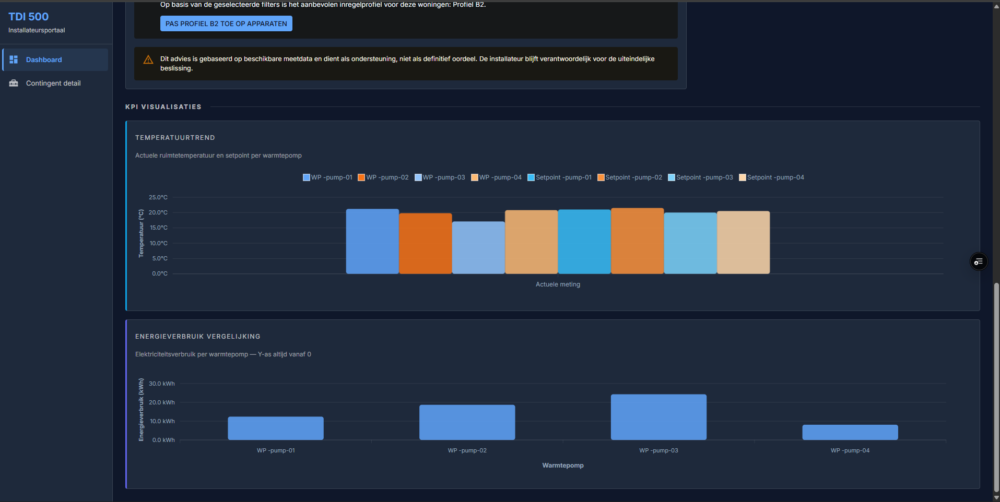

Onder de KPI-cards op het hoofddashboard staan twee chart-componenten, hier zichtbaar in mock-modus omdat live data nog onvolledig is voor deze visualisaties. De **Temperatuurtrend** toont per warmtepomp de actuele ruimtetemperatuur en het setpoint naast elkaar. De **Energieverbruik vergelijking** toont het elektriciteitsverbruik per pomp. Beide zijn gebouwd met ApexCharts (zie 1.11 voor de keuze van deze chart-library).

### Contingent-detailpagina (story #4)

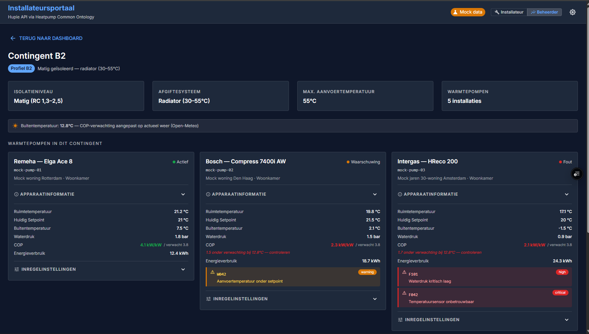

Door op een contingent te klikken vanaf het hoofddashboard kom je op de contingent-detailpagina. Hier worden alle warmtepompen binnen het geselecteerde kruisprofiel getoond, elk met apparaatinformatie, meetwaarden (ruimtetemperatuur, setpoint, waterdruk, COP, energieverbruik), en eventuele foutcodes met severity-aanduidingen (W042 warning, F101 high, F042 critical). De pagina ondersteunt zowel de **Installateur**- als de **Beheerder**-rol via de rolwisselaar in de header.

### BAG-opzoekketen — installateur-view (Path A)

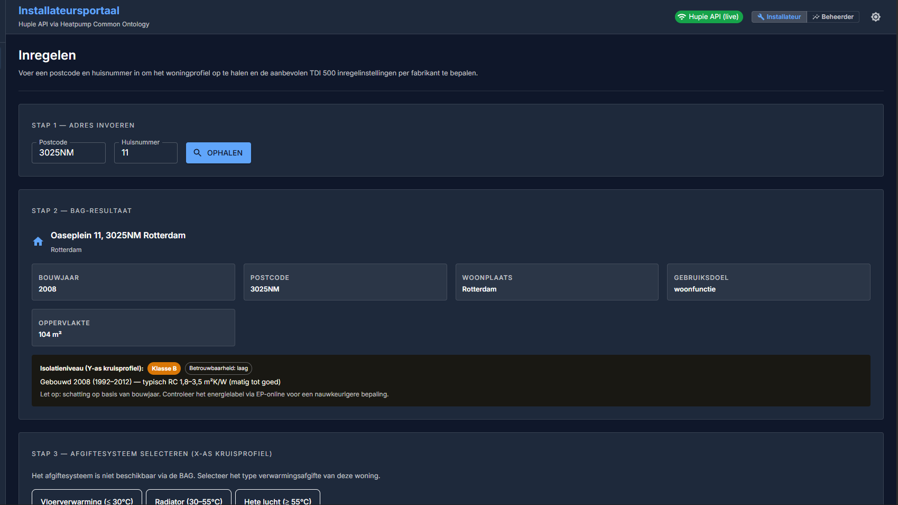

De installateur-view biedt een BAG-opzoekketen op `/bag-lookup`. De gebruiker voert een postcode en huisnummer in (hier: 3025NM 11); de applicatie haalt vervolgens via de PDOK BAG API het bouwjaar, oppervlakte, gebruiksdoel en de woonplaats op. Op basis van het bouwjaar wordt automatisch een isolatieniveau ingeschat (hier: Klasse B, hoge betrouwbaarheid omdat het bouwjaar 2008 voldoende informatie geeft). Deze functionaliteit is na de oorspronkelijke sprintscope toegevoegd als Path A-werk (zie 1.2).

### TNO-catalogus integratie (Path A)

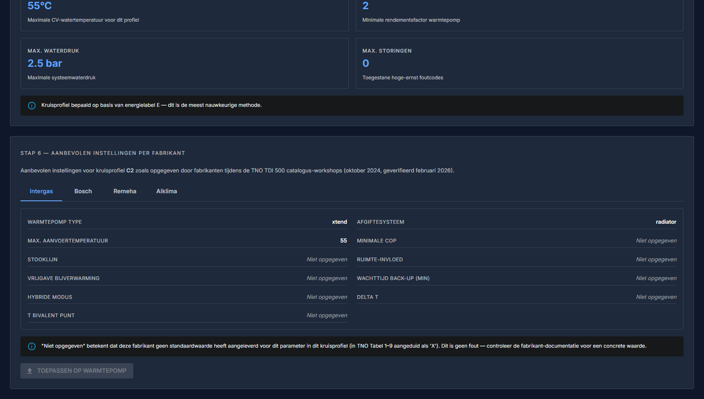

Na het bepalen van het kruisprofiel toont de BAG-opzoekketen de aanbevolen inregelinstellingen per fabrikant. De data komt uit de TNO TDI 500-catalogus (oktober 2024, geverifieerd februari 2026) en wordt getoond in tabbladen per fabrikant (Intergas, Bosch, Remeha, Alklima). Per warmtepomptype zijn aanbevolen waarden voor max. aanvoertemperatuur, stooklijn, hybride modus en andere instellingen beschikbaar; velden die de fabrikant niet heeft opgegeven worden expliciet als "Niet opgegeven" weergegeven in plaats van leeg of nul.

### Gaps en verbetervoorstellen

De volgende elementen uit het oorspronkelijke template-overzicht zijn niet als aparte screenshots opgenomen, en worden hier eerlijk benoemd:

- **Tablet- en mobiele weergaven** zijn niet apart vastgelegd. Het dashboard maakt gebruik van MUI-breakpoints die de layout automatisch aanpassen, maar dedicated mobile-first ontwerpen ontbreken. Dit is opgenomen als VV-22 in hoofdstuk 4.
- **Meerdere onderscheidbare contingenten naast elkaar** zijn niet zichtbaar in live-modus omdat de Hupie API momenteel geen `kruisProfielCode` per warmtepomp levert. Alle live-pompen vallen daarom in het geselecteerde kruisprofiel; de groeperingslogica is wel geïmplementeerd (zie 2.3.5) en klaar voor zodra de API-data beschikbaar komt.

## 2.3 Screenshots code

De code-screenshots hieronder zijn gegroepeerd op basis van de datastroom van Hupie API naar UI, in plaats van per user story. Dit volgt de architectuur uit hoofdstuk 1.7 tot en met 1.10 en maakt het makkelijker om de code-laag op een logische volgorde te lezen. Elke stap in de pipeline krijgt één screenshot.

### 1. Configuratie

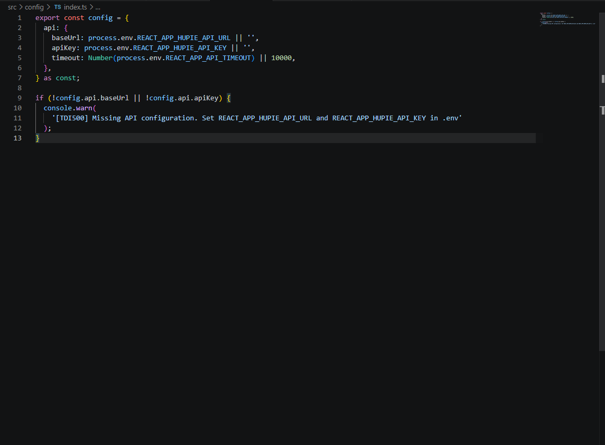

`config.ts` leest de environment variables in (`VITE_HUPIE_API_URL`, `VITE_HUPIE_API_KEY`, etc.) en exporteert ze als een typed object. Door dit centraal te doen zijn de credentials op één plek beheerbaar en zijn ze nergens hardcoded in de codebase aanwezig.

### 2. Hupie API-client

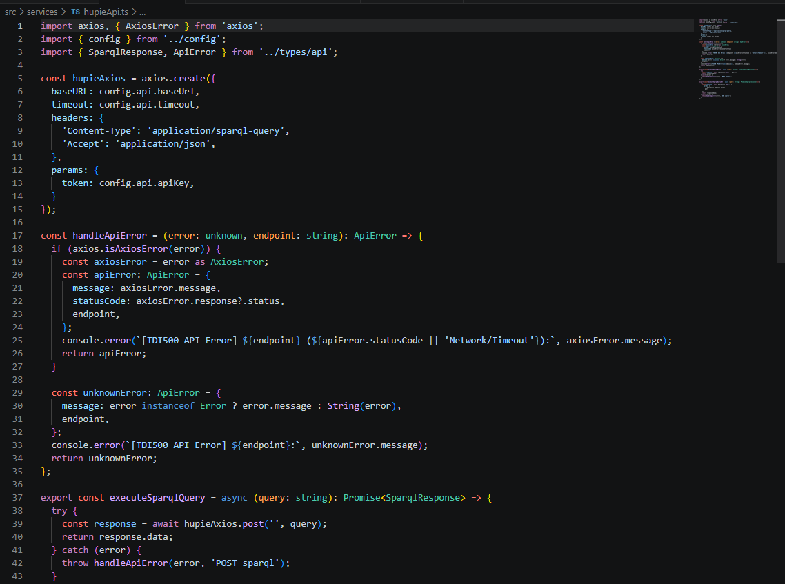

`hupieApi.ts` is de service-laag die met de Hupie SPARQL-endpoint praat via Axios. Hier zit ook de typed error-afhandeling (`RateLimitError`, `ManufacturerServerError`) en de detectie van rate-limit-responses die als HTTP 200 binnenkomen met een fouttekst in de body.

### 3. SPARQL-queries

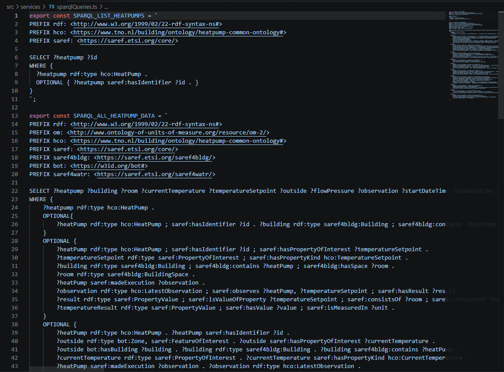

`sparqlQueries.ts` bevat de SPARQL-querystrings als constanten. Door deze te scheiden van de service-laag kunnen de queries onafhankelijk worden aangepast wanneer de Hupie-ontologie verandert, zonder de Axios-logica te raken.

### 4. Data mapping

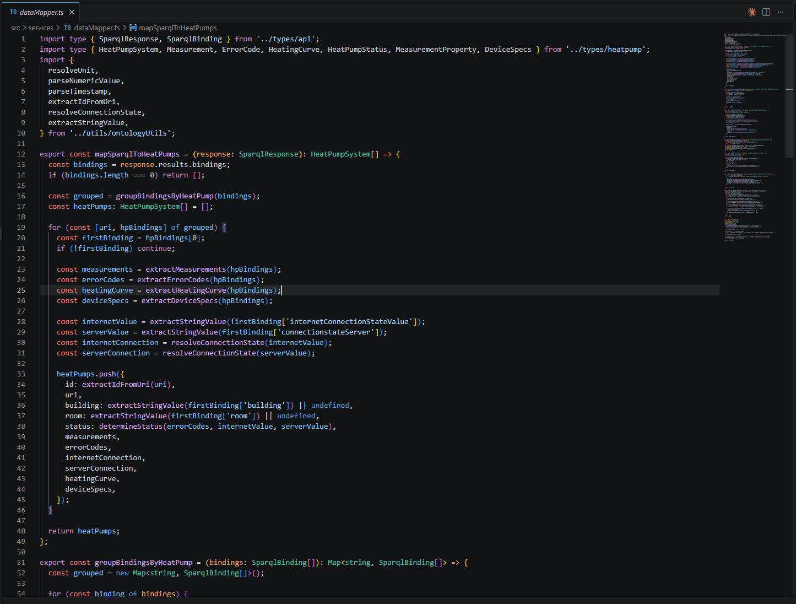

`dataMapper.ts` zet de rauwe SPARQL-bindings om naar typed TypeScript-objecten (`HeatPumpSystem`, `Measurement`, etc.). De `mapSparqlToHeatPumps`-functie groepeert eerst alle bindings per warmtepomp-URI, en bouwt vervolgens per pomp een compleet object op uit de helpers (`extractMeasurements`, `extractErrorCodes`, `resolveConnectionState`, etc.) die in `ontologyUtils.ts` zijn gedefinieerd.

### 5. Contingent-service

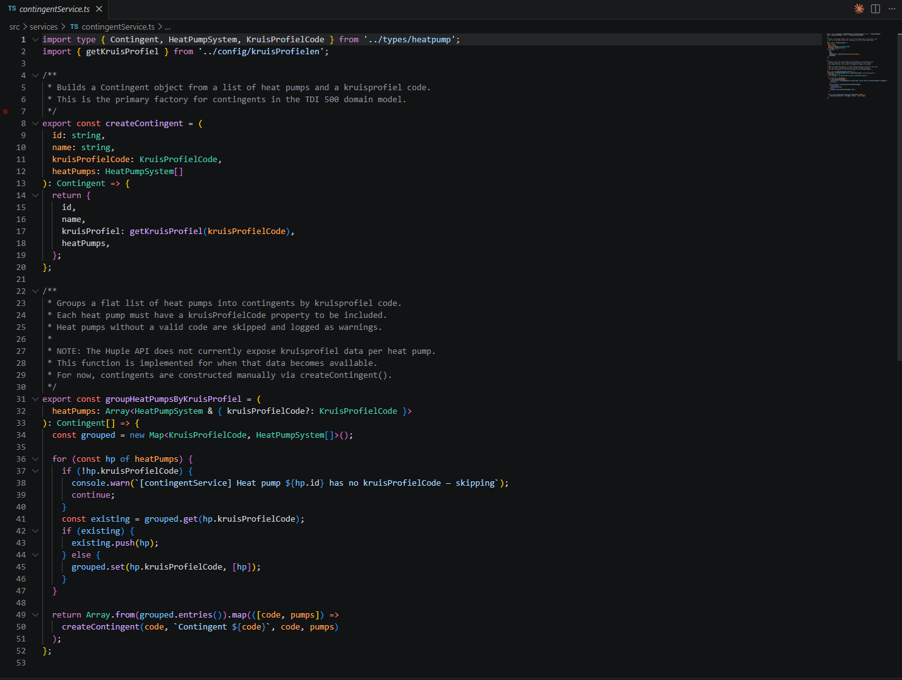

`contingentService.ts` groepeert de getypeerde warmtepompen tot contingenten op basis van het kruisprofiel (`groupHeatPumpsByKruisProfiel`). Warmtepompen zonder kruisprofiel-code worden overgeslagen en gelogd. De Hupie API levert dit veld op dit moment nog niet, dus contingenten worden voorlopig handmatig opgebouwd via `createContingent`; de groeperingsfunctie is wel klaar voor zodra de data beschikbaar komt.

### 6. React data-hook

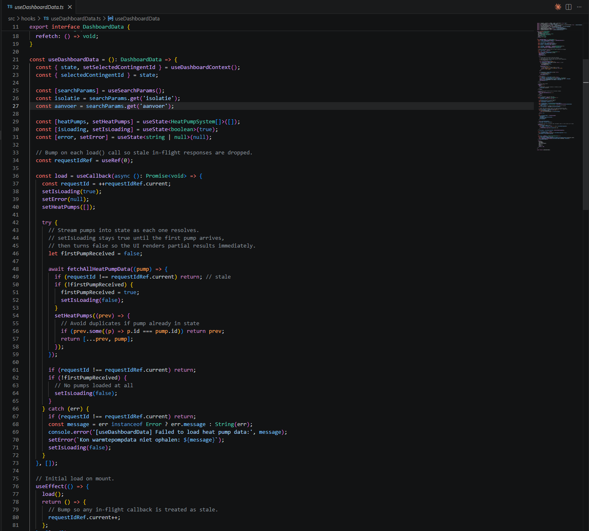

`useDashboardData` is een custom React-hook die de data-load orkestreert. In de zichtbare code wordt de streaming-aanpak getoond: warmtepompen worden incrementeel toegevoegd aan de state zodra ze binnenkomen, met een `requestIdRef`-patroon om stale in-flight responses te negeren als de gebruiker bijvoorbeeld snel van filter wisselt. De pagina-componenten consumeren de uiteindelijke `DashboardData` interface en bevatten zelf geen data-laadlogica.

### 7. Decision Engine

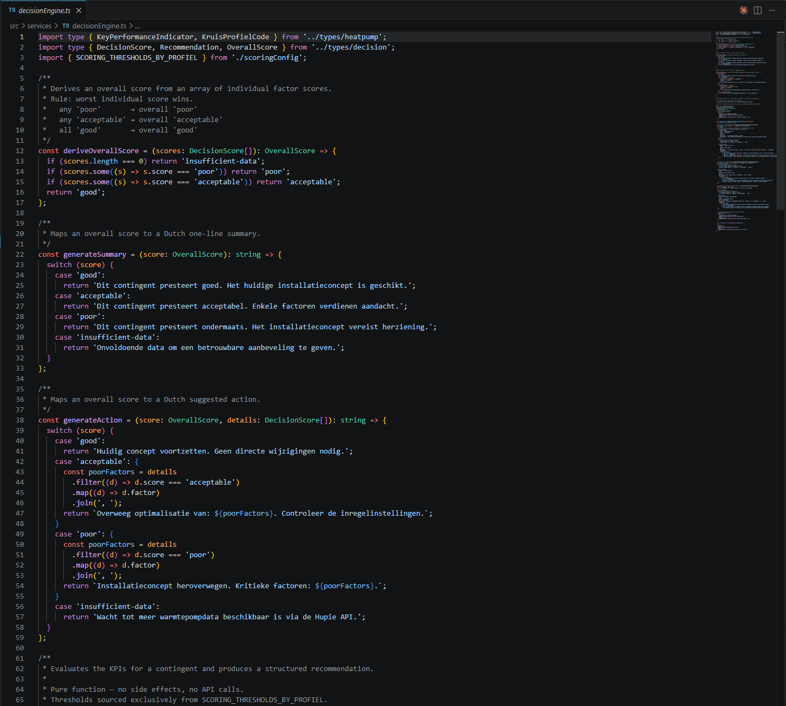

`decisionEngine.ts` produceert de uiteindelijke aanbeveling per contingent op basis van de per-factor scores. Hier zit de "worst wins"-regel: als één factor 'poor' is, wordt de totale score ook 'poor'. Ook de Dutch summary- en actie-teksten worden hier samengesteld op basis van de uiteindelijke score, inclusief expliciete afhandeling voor `'insufficient-data'` wanneer er te weinig betrouwbare data beschikbaar is.

### 8. Dashboard-pagina

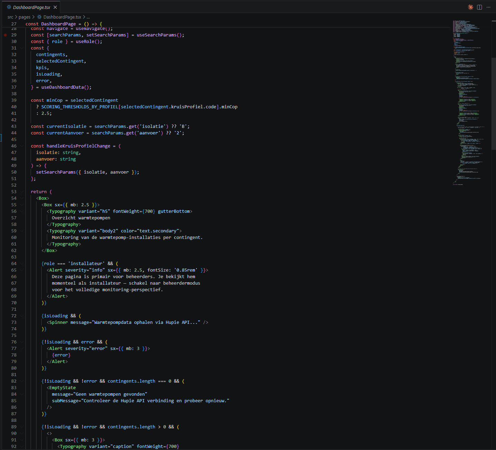

`DashboardPage.tsx` is het topcomponent van de hoofdpagina. Het consumeert `useDashboardData` voor de data, leest de kruisprofiel-filters uit de URL-parameters, haalt de scoring-drempels op uit `SCORING_THRESHOLDS_BY_PROFIEL`, en componeert de UI in meerdere states: laden (Spinner), fout (Alert), lege state (EmptyState), of de volledige dashboard-weergave met KPI-cards en charts. Als de gebruiker de rol "installateur" heeft wordt boven aan een banner getoond dat deze pagina primair voor beheerders is.

## 2.4 Screenshots commit-geschiedenis en branches

Hieronder staan drie screenshots van de GitHub-omgeving van dit project. Ze laten respectievelijk zien hoe het versiebeheer is opgezet, hoe de commits zijn georganiseerd, en hoe een Pull Request eruitziet bij dit project.

### Branch overzicht

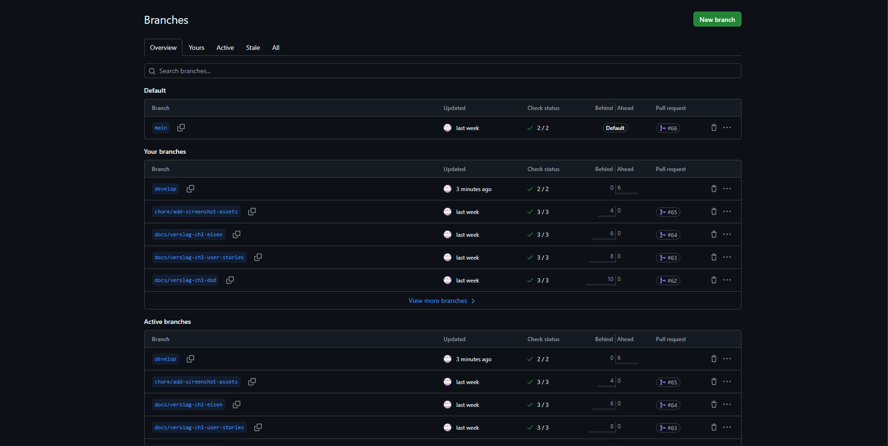

Dit is het bovenste gedeelte van de branches-pagina. Er zijn drie hoofdtypen branches te zien: `main` (default, productie), `develop` (integratie), en feature-branches voor losse stukken werk (zoals `docs/verslag-ch1-eisen` of `chore/add-screenshot-assets`). De feature-branches gebruiken een prefix-conventie: `docs/` voor verslag-werk, `chore/` voor onderhoudstaken, `fix/` voor bugfixes, `feature/` voor functionaliteit. Sommige merged branches zijn nog zichtbaar in deze lijst; de auto-delete-instelling voor branches is later in het project aangezet, dus eerdere branches blijven staan.

### Commit-geschiedenis

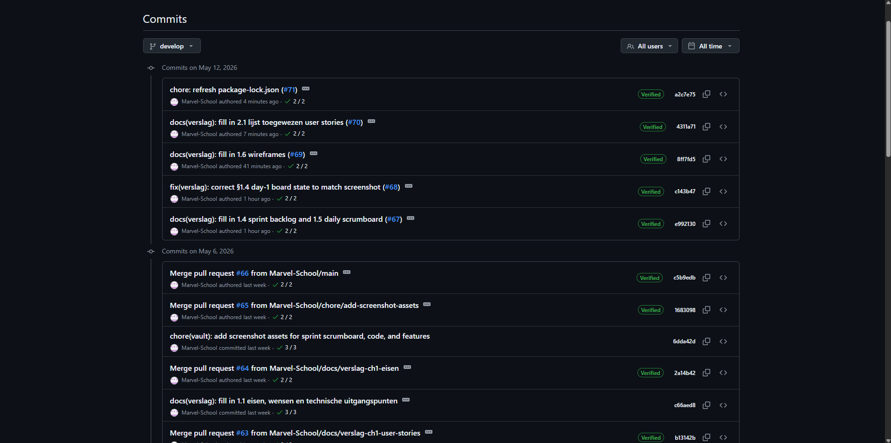

De commit-geschiedenis op `develop` laat zien dat elke commit voldoet aan drie kenmerken: een conventional commit-message (zoals `docs(verslag):`, `fix(verslag):`, `chore:`), een **Verified** badge (commits zijn met GPG ondertekend), en een groen vinkje voor de CI-checks (2/2 of 3/3 geslaagd). De pull request-merges zijn zichtbaar als losse commits omdat de squash-merge-strategie wordt gebruikt: elk PR resulteert in één commit op develop.

### Pull Request voorbeeld

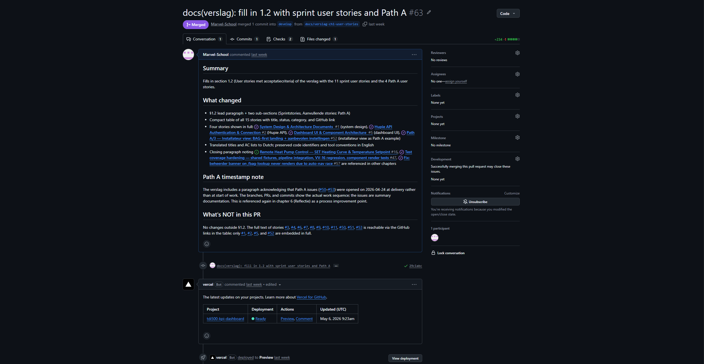

Dit is Pull Request #63, die hoofdstuk 1.2 van dit verslag invulde. Elk PR in dit project volgt een vaste structuur: een **Summary**-paragraaf bovenaan, een **What changed**-lijst met de concrete wijzigingen, en een **What's NOT in this PR**-paragraaf die de scope expliciet afbakent. Wanneer er aanvullende context nodig is (zoals bij dit PR de Path A timestamp note), staat dat in een aparte sectie. De CI-checks aan de rechterkant en de Vercel-deployment onderaan tonen automatische validatie voordat een PR samengevoegd kan worden.

# 3. Testen (B1-K1-W4)

## 3.1 Testplan

Het testen van het dashboard volgt een bewuste drielaagse aanpak:

1. Unit tests (Vitest) voor de logica-laag: de services en utilities waar correctheid het moeilijkst met het oog te controleren is (de Decision Engine, de data mapping, de KPI-aggregatie, de ontologie-conversie). Deze laag wordt geautomatiseerd getest zodat een regressie direct zichtbaar wordt.

2. End-to-end tests (Playwright) voor de UI-laag: de pagina's, charts en gebruikersflows worden in een echte browser getest, inclusief foutafhandeling (mislukte API-calls, trage responses, lege of extreme data) via netwerk-interceptie. Deze laag dekt het gedrag dat unit tests niet kunnen verifiëren — wat de gebruiker daadwerkelijk ziet en doet.

3. Handmatige tests voor het kleine restant dat niet geautomatiseerd is. Na het bouwen van de E2E-laag is hiervan nog één scenario over: snel wisselen tussen kruisprofielen (T4.3). Dit heb ik handmatig gecontroleerd.

De Definition of Done (1.3) en de keuze voor Vitest en Playwright (1.11) zijn in hoofdstuk 1 onderbouwd; dit hoofdstuk laat de uitvoering zien. User story #8 (Test Plan & Execution) wordt door dit hoofdstuk afgedekt.

Wat per laag wordt getest, met welke data en het pass/fail-criterium:

- Logica-laag (unit): getest met vaste fixtures (voorbeeldwarmtepompen en SPARQL-responses). Pass = de functie geeft de verwachte getypeerde output; fail = afwijking of een onverwachte exception.
- UI-laag (E2E): getest in een echte browser, deels in mock-modus (deterministische data) en deels in live-modus met onderschepte API-responses, om foutscenario's gecontroleerd af te dwingen. Pass = het scherm toont de juiste staat (data, fout, of laad-indicator); fail = verkeerde weergave, crash of vastlopen.
- Handmatige laag: gecontroleerd in de browser. Pass = correct gedrag bij visuele inspectie; fail = layout-breuk of verkeerd gedrag.

## 3.2 Automatische testen (Vitest)

De automatische testsuite bestaat uit 229 tests verdeeld over 27 testbestanden, allemaal uitgevoerd met Vitest. De volledige suite slaagt:

```
 Test Files  27 passed (27)
      Tests  229 passed (229)
   Duration  10.39s
```

De tests zijn georganiseerd per laag:

- **Services / businesslogica (18 bestanden)** — onder andere `decisionEngine`, `dataMapper`, `kpiAggregator`, `weatherService`, `sparqlQueries`, `contingentService`, `bagService`, `tnoCatalogus` en `ontologyUtils`. Dit is de kern van de logica-laag en heeft de hoogste dekking (zie 3.5).
- **Hooks / context (3 bestanden)** — `copContext`, `roleContext`, en `useDashboardData`. Let op: `useDashboardData.test.ts` test de integratie van de services die de hook samenstelt (contingent-constructie + KPI-aggregatie), niet de React-lifecycle-code van de hook zelf. Die React-code is handmatig getest, conform de tweelaagse aanpak.
- **Componenten (5 bestanden)** — render-tests voor onder andere `aanbevolenInstellingen`, `bagLookupPage`, en `mainLayout` auto-navigatie.
- **Integratie (1 bestand)** — `pipeline.integration` test de volledige datastroom van API tot KPI in samenhang.

Bij het draaien van de testsuite verschijnt in `roleContext.test.tsx` de logregel `Error: useRole must be used within a RoleProvider`. Dit is geen falende test maar een bewust geteste foutpad-assertie: de test controleert dat de hook een fout gooit wanneer hij buiten de provider wordt gebruikt.

Er is geen falende-test-naar-fix cyclus om te tonen, omdat de tests gedurende de ontwikkeling zijn meegegroeid met de code in plaats van achteraf zijn toegevoegd. Waar tests tijdens het ontwikkelen faalden, is dat opgelost vóór de commit; de commit-historie laat groene checks zien op elke merge (zie 2.4).

## 3.3 Handmatige testscenario’s

De onderstaande tabellen tonen per user story de uitgevoerde testscenario's, met het type test (unit, E2E, of handmatig), de bewijsbron en het resultaat. De visuele bevestiging van werkende functionaliteit staat in 2.2.

Issue #2 — API Connection

| Test ID | Scenario | Type | Bewijs | Resultaat |
|---------|----------|------|--------|-----------|
| T2.1 | Happy flow — geldige respons | Unit + screenshot | hupieApiTwoPhase.test.ts, 2.2 | PASS |
| T2.2 | Ongeldige credentials (401) | E2E | api-failure.live.e2e.ts (401) | PASS |
| T2.3 | API onbereikbaar | E2E | api-failure.live.e2e.ts (abort) | PASS |
| T2.4 | Verkeerde URL | E2E | api-failure.live.e2e.ts (abort) | PASS |

T2.3 en T2.4 worden door hetzelfde mechanisme afgedekt: een mislukte verbinding leidt in beide gevallen tot dezelfde foutafhandeling. De E2E-test verifieert dat de applicatie bij 401, 500 én een afgebroken verbinding de foutmelding correct toont.

Issue #3 — Data Mapping

| Test ID | Scenario | Type | Bewijs | Resultaat |
|---------|----------|------|--------|-----------|
| T3.1 | Happy flow — geldige bindings | Unit | dataMapper.test.ts | PASS |
| T3.2 | Ontbrekende velden | Unit | dataMapper.test.ts | PASS |
| T3.3 | Onbekende URI | Unit | dataMapper.test.ts | PASS |
| T3.4 | Lege respons | Unit | dataMapper.test.ts | PASS |

Issue #4 — Contingent Link

| Test ID | Scenario | Type | Bewijs | Resultaat |
|---------|----------|------|--------|-----------|
| T4.1 | Contingent selecteren | E2E + screenshot | contingent.e2e.ts, 2.2 | PASS |
| T4.2 | Leeg contingent | E2E | edge-data.live.e2e.ts (empty-state) | PASS |
| T4.3 | Snel wisselen tussen profielen | Handmatig | Browser-controle | PASS |
| T4.4 | Laden mislukt | E2E | api-failure.live.e2e.ts (500) | PASS |

T4.3 (snel wisselen tussen kruisprofielen) test de stale-response-afhandeling in useDashboardData (zie 2.3.6). Dit heb ik handmatig gecontroleerd: bij snel wisselen toont het dashboard altijd de data van het laatst geselecteerde profiel, zonder verouderde data. Het automatiseren hiervan is opgenomen als verbetervoorstel in hoofdstuk 4.

Issue #5 — Dashboard UI

| Test ID | Scenario | Type | Bewijs | Resultaat |
|---------|----------|------|--------|-----------|
| T5.1 | Desktop layout | E2E + screenshot | dashboard.e2e.ts, 2.2 | PASS |
| T5.2 | Tablet layout (iPad) | E2E | responsive.e2e.ts (dashboard/contingent/BAG @768) | PASS |
| T5.3 | Lange namen | E2E | long-names.live.e2e.ts (desktop + 768) | PASS |
| T5.4 | Trage respons | E2E | slow-response.live.e2e.ts | PASS |

T5.2 (tablet-weergave) is in eerste instantie handmatig getest en bleek niet goed te werken: de views liepen over bij iPad-portretbreedte (768px). Na een fix (zie 4) heb ik dit geautomatiseerd met responsive.e2e.ts, die voor alle drie de views controleert dat er geen horizontale overflow is op 768px. De telefoon-weergave (<600px) valt buiten de scope en is een verbetervoorstel in hoofdstuk 4. T5.3 (lange namen) wordt afgedekt door long-names.live.e2e.ts: een warmtepomp met een extreem lange naam wordt ingeschoten en de test controleert dat de naam netjes afbreekt zonder de layout te breken.

Issue #6 — KPI Charts

| Test ID | Scenario | Type | Bewijs | Resultaat |
|---------|----------|------|--------|-----------|
| T6.1 | Charts met data | E2E + screenshot | dashboard.e2e.ts, 2.2 | PASS |
| T6.2 | Enkel datapunt | E2E | edge-data.live.e2e.ts | PASS |
| T6.3 | Geen data | E2E | edge-data.live.e2e.ts (empty-state) | PASS |
| T6.4 | Extreme waarden | E2E | edge-data.live.e2e.ts (COP 99) | PASS |

Issue #7 — Decision Support

| Test ID | Scenario | Type | Bewijs | Resultaat |
|---------|----------|------|--------|-----------|
| T7.1 | Goede/acceptabele score | E2E + unit + screenshot | dashboard.e2e.ts, decisionEngine.test.ts, 2.2 | PASS |
| T7.2 | Slechte score | Unit + screenshot | decisionEngine.test.ts, 2.2 | PASS |
| T7.3 | Onvoldoende data | Unit | decisionEngine.test.ts | PASS |
| T7.4 | Ontbrekende KPI's | Unit | decisionEngine.test.ts | PASS |
| T7.5 | Alle foutcodes | E2E | decision-errors.live.e2e.ts | PASS |

T7.5 (alle foutcodes) schiet een warmtepomp met meerdere foutcodes in en controleert dat de foutcodes correct worden getoond op de contingent-detailpagina.

## 3.4 Test summary table

*[Vul de tabel in na het uitvoeren van alle testen]*

| **Test ID** | **Type**  | **Feature**      | **Beschrijving**              | **Resultaat**   |
|-------------|-----------|------------------|-------------------------------|-----------------|
| T-AUTO-3.1  | Auto      | Data Mapping     | parseMeasurements valid input | *[PASS/FAIL]* |
| T-AUTO-3.2  | Auto      | Data Mapping     | parseMeasurements empty       | *[PASS/FAIL]* |
| T-AUTO-4.1  | Auto      | KPI Aggregator   | aggregateKPIs valid           | *[PASS/FAIL]* |
| T-AUTO-7.1  | Auto      | Decision Engine  | evaluateContingent good       | *[PASS/FAIL]* |
| T2.1        | Handmatig | API Connection   | Happy flow — 200 OK           | *[PASS/FAIL]* |
| T2.2        | Handmatig | API Connection   | Invalid credentials           | *[PASS/FAIL]* |
| T4.1        | Handmatig | Contingent Link  | Select contingent             | *[PASS/FAIL]* |
| T5.1        | Handmatig | Dashboard UI     | Desktop layout                | *[PASS/FAIL]* |
| T6.1        | Handmatig | KPI Charts       | Charts with real data         | *[PASS/FAIL]* |
| T7.1        | Handmatig | Decision Support | Good recommendation           | *[PASS/FAIL]* |

## 3.5 Conclusies uit testen

Conclusie per feature:

*[Per feature: hoeveel tests geslaagd/gefaald, zijn acceptatiecriteria behaald, bekende issues.]*

Algehele conclusie:

*[Algemene kwaliteit van de applicatie. Sterke punten. Verbeterpunten (input voor verbetervoorstellen).]*

# 4. Verbetervoorstellen (B1-K1-W5)

## 4.1 Analyse informatiebronnen

Testresultaten:

*[Welke testen faalden? Welke edge cases waren problematisch?]*

Feedback sprint review (Jeroen Pat):

*[Wat zei Jeroen tijdens de review? Positief? Verzoeken? Issues?]*

Retrospective bevindingen:

*[Procesproblemenm, tijdsinschatting, werkwijze]*

Bugs / GitHub Issues:

*[Bugs gevonden tijdens de sprint die niet zijn opgelost]*

## 4.2 Interpretatie bevindingen

*[Per bevinding: wat is het onderliggende probleem? Hoe ernstig? Wie wordt geraakt?]*

## 4.3 Verbetervoorstellen

Voorstel 1 (functioneel):

*[Bron \| Probleem \| Voorstel \| Nieuwe user story + acceptatiecriteria \| Prioriteit (MoSCoW) \| Geschatte tijd]*

Voorstel 2 (technisch):

*[Bron \| Probleem \| Voorstel \| Nieuwe user story + acceptatiecriteria \| Prioriteit (MoSCoW) \| Geschatte tijd]*

Voorstel 3 (proces):

*[Bron \| Probleem \| Voorstel \| Nieuwe user story + acceptatiecriteria \| Prioriteit (MoSCoW) \| Geschatte tijd]*

## 4.4 Nieuwe user stories op product backlog

*[Beschrijf de nieuwe user stories die zijn toegevoegd aan het GitHub Projects scrumboard.]*

*[Screenshot: Product backlog met nieuwe user stories]*

# 5. Overleg (B1-K2-W1)

## 5.1 Scrumboard screenshots

Zie sectie 1.5 voor de dagelijkse scrumboard screenshots.

## 5.2 Overlegafspraken

*[Afspraken die niet op het scrumboard staan: technische beslissingen, API-gerelateerde keuzes, afspraken met Jeroen Pat.]*

## 5.3 Overzicht uitgevoerde activiteiten

*[Overzicht van wat er per dag is gedaan op basis van de gemaakte afspraken.]*

# 6. Reflectie (B1-K2-W3)

## 6.1 Proces

Wat ging goed:

*[Min. 2 concrete punten met verwijzing naar specifieke sprint-events]*

Wat kan beter:

*[Min. 2 concrete punten]*

Wat ga ik anders doen:

*[Min. 2 concrete acties]*

## 6.2 Samenwerking

Wat ging goed:

*[Min. 2 concrete punten over communicatie met Jeroen Pat, API developer]*

Wat kan beter:

*[Min. 2 concrete punten]*

Wat ga ik anders doen:

*[Min. 2 concrete acties]*

## 6.3 Eigen prestaties

Wat ging goed:

*[Min. 2 concrete punten — waar ben je trots op?]*

Wat kan beter:

*[Min. 2 concrete punten — waar worstelde je mee?]*

Wat ga ik anders doen:

*[Min. 2 concrete acties — welke skills ontwikkelen?]*